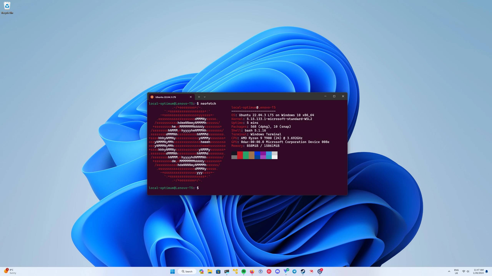
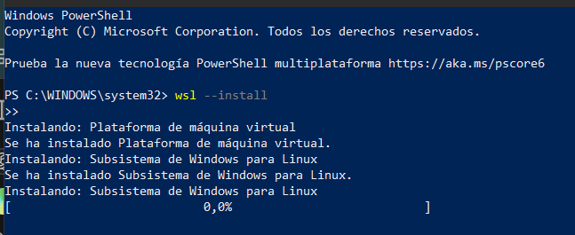
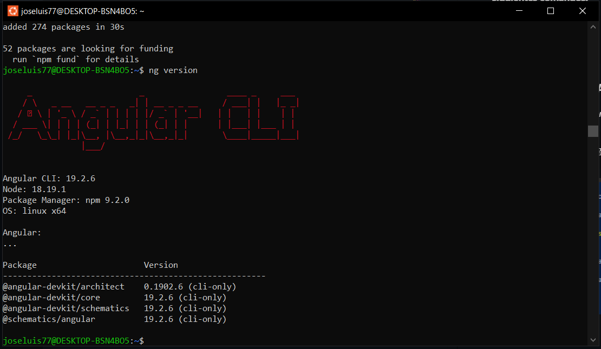
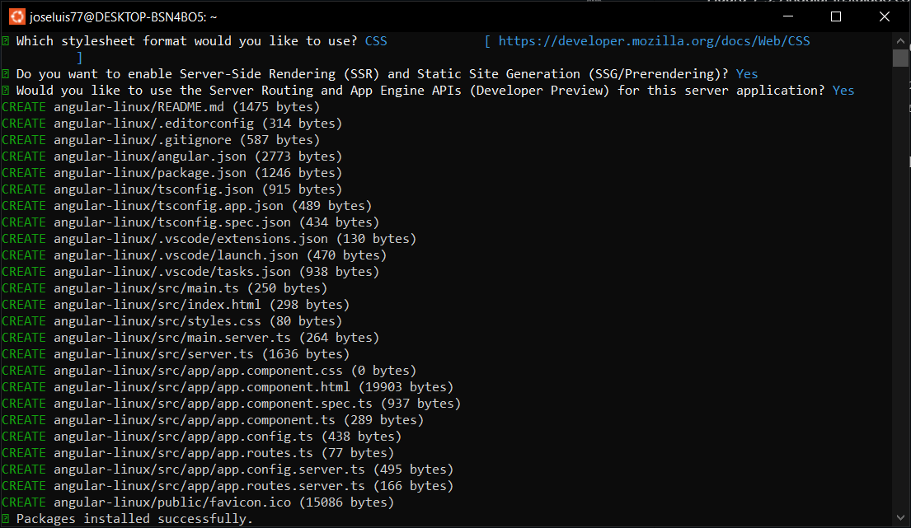
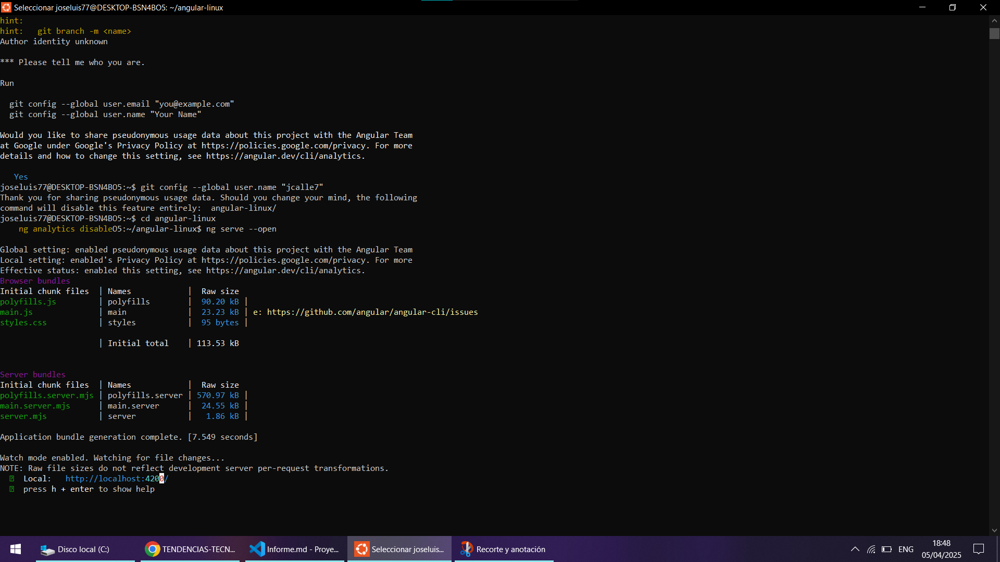
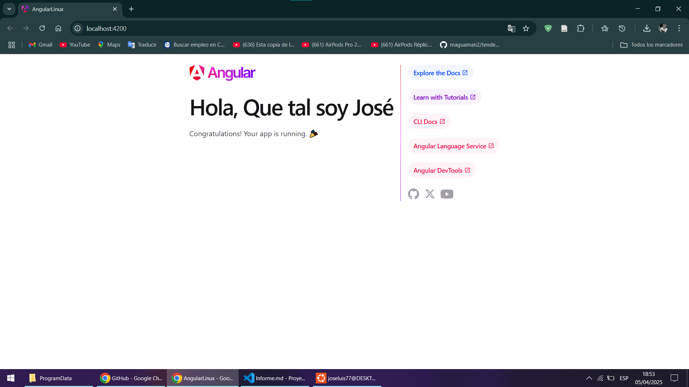

# Práctica: Elaboración y estructuración de un proyecto de Angular mediante comandos de Linux
## 1. Título.
Configuración y Desarrollo de Aplicaciones Angular con WSL en Windows 10
## 2. Tiempo de duración.
* Instalación de WSL: 15 MINUTOS
* Configuración Inicial de Ubuntu: 15 MINUTOS
* Instalación de dependecias: 20 MINUTOS
* Ejecutar y verificar el proyecto: 10 MINUTOS
### Duración total: 1 hora
## 3. Fundamentos.
### ¿Qué es Angular?
Angular es un framework de desarrollo web creado por Google que permite construir aplicaciones dinámicas del lado del cliente utilizando HTML, CSS y TypeScript. Es ampliamente utilizado por su arquitectura modular, soporte para componentes reutilizables, inyección de dependencias y herramientas integradas para pruebas y despliegue.
### ¿Qué es WSL?
WSL es una característica de Windows 10 que permite ejecutar un entorno GNU/Linux directamente en Windows, sin necesidad de máquinas virtuales. Con WSL se puede instalar una distribución de Linux como Ubuntu, acceder a los archivos y ejecutar comandos como si estuvieramos en una terminal nativa de Linux.

Esto es útil para desarrolladores que necesitan herramientas disponibles en Linux como el administrador de paquetes apt, Node.js, o scripts de automatización, pero sin abandonar el sistema operativo Windows.

*Imagen referencial Angular*


*Imagen referencial WSL*


## 4. Conocimientos previos.
Para realizar esta práctica el estudiante necesita tener en claro los siguientes temas: 
- Comandos Linux
- Uso de la terminal Windows / Linux
- Conceptos básicos en la creación de proyectos ANGULAR
- Conocimientos básicos de Node.js y npm
- Conocer qué es el Angular CLI y para qué sirve.

## 5. Objetivos a alcanzar.
* Instalar y configurar WSL (Windows Subsystem for Linux) en un equipo con Windows 10, utilizando la terminal para preparar el entorno Linux.

* Instalar Node.js y Angular CLI en Ubuntu (WSL) mediante el uso del gestor de paquetes apt y npm.

* Crear un proyecto Angular desde la línea de comandos utilizando Angular CLI, entendiendo la estructura generada automáticamente.

* Ejecutar una aplicación Angular en un entorno de desarrollo local, y verificar su funcionamiento a través del navegador web.

* Fomentar el uso de herramientas profesionales como Visual Studio Code, integradas con WSL para el desarrollo de aplicaciones modernas.

## 6. Equipo necesario.
* Computador con sistema operativo Windows/ Linux/ Mac, etc.
* Nodejs y paquetes NPM instalados.
* Angular CLI instalado globalmente en el equipo.
* WSL instalado.
* Terminales CMD o Powershell.
* Ubuntu instalado.
* IDE de preferencia: **Visual Studio Code.**

## 7. Material de apoyo.
* Documentación oficial de Angular.
* Documentación oficial de WSL.
* Documentación oficial de Ubuntu.
* Guía de comandos Linux.
* Materiales audiovisuales de apoyo colocados en el EVA por parte del docente.

## 8. Procedimiento.
### Paso 1: **Instalar WSL y Ubuntu juntos**
*Ejecutamos como administrador PoweShell y ejecutamos el siguiente comando:*
```
wsl --install
```


*Figura 1-2*: Instalación de WSL y Ubuntu.

### Paso 2: **Después de reiniciar el ordenador abrimos la aplicación Ubuntu que se nos instaló y nos creamos un usuario y una contraseña para el entorno Linux:** 


*Figura 1-2*: WSL y Ubuntu instalados correctamente en el ordenador.


*Figura 1-3*: Se instaló correctamente la versión  24.04.1 LTS de Ubuntu.
### Paso 3: **Instalar Node.js y Angular CLI en WSL:** 
*Abrimos la terminal de Ubuntu y ejecutamos los siguientes comandos*:

**Para Node.js y los paquetes de npm:**
```
sudo apt update
sudo apt install -y nodejs npm
```


*Figura 1-4*: Node.js y NPM instalados correctamente

**Si es que se desea ver la versión de Node y NPM instaladas, ejecutamos los siguientes comandos:**
```
node -v
npm -v
```
### Paso 4: **Instalamos Angular CLI en WSL Ubuntu:**
*Ejecutamos el siguiente comando en la terminal de Ubuntu*
```
sudo npm install -g @angular/cli
```


*Figura 1-5*: Angular instalado correctamente en el equipo con la versión 19.2.6.

### Paso 5: **Procedemos a crear nuestro proyecto en Angular:**
*Ejecutamos el siguiente comando para poder crear nuestro nuevo proyecto en angular desde la terminal de Ubuntu*
```
ng new angular-linux
```


*Figura 1-6*: Proyecto Angular creado correctamente.

### Paso 6: **Una vez finalizado la creación de nuestro proyecto Angular procedemos a navegar hacia él y lo levantamos.**
*Ejecutamos estos comandos en la terminal de Ubuntu para poder navegar hacia nuestro proyecto y poder levantarlo*.

```
cd angular-linux
ng serve --open
```


*Figura 1-7*: Proyecto Angular levantado y corriendo correctamente.

## 9. Resultados esperados.



*Figura 1-8*: Aplicación Angular correctamente ejecutada corriendo en el puerto ```localhost:4200```

Al instalar Node.js y Angular CLI en WSL, se debe esperar que la terminal confirme la instalación de ambos sin errores. Al crear un nuevo proyecto con el comando ng new, Angular CLI pedirá configuraciones como el uso de routing y la selección de estilo (CSS, SCSS). Si se elige routing, Angular CLI generará automáticamente el archivo app-routing.module.ts. Si se utiliza Git para el control de versiones, es común que aparezca un mensaje sobre la configuración de la identidad del usuario, solicitando el nombre y correo electrónico con los comandos git config --global user.name y git config --global user.email. Si no se configuran, Git mostrará un error fatal impidiendo realizar operaciones de control de versiones.

Además, se puede recibir una advertencia sobre el nombre de la rama principal ("master"), sugiriendo cambiarlo a "main" por cuestiones de inclusión, lo que se puede configurar con git config --global init.defaultBranch main. En resumen, los resultados esperados son la correcta instalación de las herramientas necesarias, la creación del proyecto Angular con las configuraciones iniciales y la correcta configuración de Git para evitar problemas con la identidad del usuario y las ramas.

## Audio explicativo de la realización de la práctica.

[Link del Audio Explicativo](https://drive.google.com/file/d/1kIOCrVuBg09TnYyWMSd-rDZb6I0R_5PE/view?usp=sharing)

## Bibliografía
- *¿Qué es Angular? (2025).* **Recuperado de:** <https://angular.dev/overview> 
- *Todo sobre WSL (Windows Subsystem for Linux) (2024).* **Recuperado de:** <https://www.godaddy.com/resources/es/digitalizacion/ws-windows-subsystem-linux-que-es>
- *¿Qué es el Subsistema de Windows para Linux? (2025).* **Recuperado de:** <https://learn.microsoft.com/es-es/windows/wsl/about> 
- *Diego B. (2025) ¿Qué es Ubuntu? Una guía rápida para principiantes.* **Recuperado de:** <https://www.hostinger.com/es/tutoriales/que-es-ubuntu> 

- *Guía de escritorio de Ubuntu (s.f).* **Recuperado de:** <https://help.ubuntu.com/lts/ubuntu-help/index.html>


