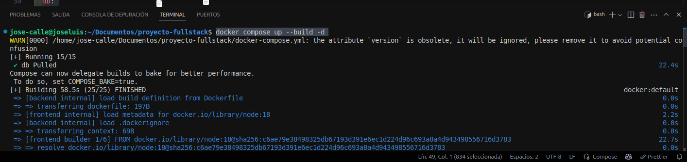

# Práctica Aplicación en modo producción.
## 1. Título.
Despliegue de Aplicación Full Stack con Nginx en Producción usando Docker y Docker Compose.
## 2. Tiempo de duración.
**Tiempo total de aproximada**: 90 - 120 minutos.
## 3. Fundamentos.
Esta práctica se basa en la construcción y despliegue de una aplicación full stack utilizando contenedores Docker, lo que permite replicar entornos de desarrollo y producción de manera controlada, aislada y portable.

**Docker y contenedores**

Docker es una plataforma para desarrollar, enviar y ejecutar aplicaciones dentro de contenedores. Los contenedores permiten empaquetar una aplicación con todo lo que necesita (dependencias, configuración, sistema base) y ejecutarla de forma consistente sin importar el entorno.

**Dockerfile**

Un Dockerfile es un archivo de texto que contiene los pasos necesarios para construir una imagen. En esta práctica usaremos uno con Node.js para compilar nuestro frontend, y otro para preparar un entorno de producción con Nginx.

**Nginx**

Nginx será el servidor HTTP encargado de servir los archivos estáticos de nuestra aplicación frontend. Es muy eficiente para aplicaciones en producción, especialmente cuando se integra con otras capas backend.

**Docker compose**

Es una herramienta que permite definir y manejar múltiples contenedores de Docker en un solo archivo ```docker-compose.yml```. Nos ayuda a orquestar el backend, frontend y base de datos de forma simultánea.

**Ejemplo visual de como interactúan los elementos principales de Docker**


*Figura 1-1*: Arquitectura básica del ecosistema Docker.

## 4. Conocimientos previos.
Para desarrollar esta práctica correctamente, el estudiante debe dominar los siguientes temas:

* Conocimiento básico de terminal y comandos Linux.

* Manejo de editores de texto como VSCode.

* Comprensión del ciclo de vida de una aplicación web: frontend, backend, base de datos.

* Manejo básico de Docker: creación de imágenes, ejecución de contenedores, volúmenes, redes.

* Fundamentos de redes en Docker: puertos, mapeos, etc.

* Configuración básica de Nginx.

* Lectura de logs y solución de errores comunes en contenedores.
## 5. Objetivos a alcanzar.
* Construir el frontend con un Dockerfile usando una imagen de Node.js.

* Desplegar el frontend en modo producción con Nginx mediante contenedor Docker.

* Integrar frontend, backend y base de datos en un entorno único usando Docker Compose.

* Manipular archivos de configuración como ```default.conf``` de Nginx y ```.env``` del backend.

* Ejecutar y probar localmente la aplicación completa desde contenedores.

* Familiarizarse con prácticas estándar de despliegue en producción.
## 6. Equipo necesario.
Computador con sistema operativo:

* Windows 10+ / Linux Ubuntu 20.04+ / macOS

* Docker instalado y funcionando versión recomendada: 24.x.x

* Docker Compose (v2.x integrado en Docker CLI)

* Editor de texto como VSCode

* Cuenta en ```https://labs.play-with-docker.com/``` si no se instala localmente
## 7. Material de apoyo.
* Documentación oficial de Docker

* Documentación oficial de Nginx

* Guía de asignatura 

* Linux Command Cheat Sheet 

* Ejemplos de configuración de ```docker-compose``` y ```Dockerfile``` desde repositorios de GitHub confiables
## 8. Procedimiento.
* ### Paso 1: **Creamos el ```Dockerfile``` para el Frontend**
Nos ubicamos en ```/frontend/``` y ejecutamos la siguientes lineas de código:
```
FROM node:18 AS builder

WORKDIR /app

COPY package*.json ./
RUN npm install

# 👇 Copiar el archivo correcto
COPY .env.production .env

COPY . .

RUN npm run build

FROM nginx:alpine

COPY --from=builder /app/dist /usr/share/nginx/html
COPY nginx.conf /etc/nginx/conf.d/default.conf

EXPOSE 80
CMD ["nginx", "-g", "daemon off;"]
```
* ### Paso 2: **Creamos el archivo ```nginx.conf``` para servir el frontend**
En la raiz de ```frontend/```, creamos el archivo y ejecutamos estas lineas de código:
```
# frontend/nginx.conf
server {
    listen 80;
    server_name localhost;

    location / {
        root /usr/share/nginx/html;
        index index.html;
        try_files $uri $uri/ /index.html;
    }
}
```
* ### **Paso 3: Crear el dockerfile para el backend**
Nos ubicamos en ```/backend/``` y ejecutamos estas lineas de código:
```
# backend/Dockerfile
FROM node:20-alpine

WORKDIR /app

COPY package*.json ./
RUN npm install

COPY . .

ENV NODE_ENV=production

EXPOSE 4000
CMD ["node", "src/index.js"]
```
* ### **Paso 4: Modificamos el archivo ```.env.production```**
En ves de ```backend``` le cambiamos a ```localhost```, ya que ese es el nombre del servicio que tenemos en el ```docker-compose.yml```:
```
VITE_API_URL=http://localhost:4000
```
* ### *Paso 4: Creamos el ```docker-compose.yml``` en la raiz de nuestros proyectos**
Cabe mencionar que tengo en una carpeta padre mi backend y mi frontend, por lo tanto creamos ese archivo docker en la raiz principal:
```
version: '3.8'

services:
  backend:
    build:
      context: ./backend
      dockerfile: Dockerfile
    container_name: backend
    ports:
      - "4000:4000"
    environment:
      - NODE_ENV=production
    networks:
      - fullstack-net

  frontend:
    build:
      context: ./frontend
      dockerfile: Dockerfile
    container_name: frontend
    ports:
      - "5173:80"
    depends_on:
      - backend
    networks:
      - fullstack-net

  db:
    image: postgres:15
    container_name: postgres-db
    environment:
      POSTGRES_USER: user
      POSTGRES_PASSWORD: password
      POSTGRES_DB: mydb
    ports:
      - "5432:5432"
    volumes:
      - pgdata:/var/lib/postgresql/data
    networks:
      - fullstack-net

volumes:
  pgdata:

networks:
  fullstack-net:
```
* ### Paso 5: **Levantamos tanto el ```frontend``` como el ```backend```
Ejecutamos el siguiente comando en la terminal de VSC:
```
docker compose up --build -d
```


*Figura 1-2*: Contenedores de docker inicializandose


*Figura 1-3*: Todos los procesos, contenedores, backend y frontend se ejecutaron de manera exitosa

**Ahora procedemos a ver los contenedores que estan corriendo:**

```
docker ps
```


*Figura 1-4*: aplicación fullstack ```frontend``` ```backend``` y ```base de datos``` está corriendo impecablemente en contenedores Docker

## 9. Resultados esperados.
* Se logró desplegar exitosamente una aplicación fullstack utilizando contenedores Docker.

* El **frontend**, construido con ```Vite + React + TypeScript```, fue empacado en modo producción y servido por ```Nginx```, hosteado en la ruta ```http://localhost:5173```

* El **backend**, construido con **Express** y **TypeScript**, respondió correctamente a las peticiones API desde el contenedor del frontend, hosteado en la ruta ```http://localhost:4000/api/estudiantes```

* La variable de entorno ```VITE_API_URL``` fue correctamente configurada y consumida en tiempo de build.

* Se solucionó un error de despliegue crítico en el que el frontend intentaba consumir la API desde una ruta equivocada.

* La tabla de estudiantes se renderiza con datos reales obtenidos desde el backend.


*Figura 1-5*: Conexión exitosa entre el frontend y backend en contenedores Docker.
## 10. Audio explicativo.
[Link del Audio explicativo](https://drive.google.com/file/d/1CAxswQ6aa_Hr4SVyhltAxGvYn768lE0h/view?usp=sharing)
## 11. Bibliografías.
- *React Documentation (2025).* **Recuperado de**: <https://react.dev/learn>
- *Vite – Next Generation Frontend Tooling (2025).* **Recuperado de**: <https://vitejs.dev/guide/>
- *TypeScript Handbook (2025).* **Recuperado de**: <https://www.typescriptlang.org/docs/>
- *Express.js API Reference (2025).* **Recuperado de**: <https://expressjs.com/en/5x/api.html>
- *Docker Docs: Containerize your applications (2025).* **Recuperado de**: <https://docs.docker.com/get-started/>
- *Docker Compose Reference (2025).* **Recuperado de**: <https://docs.docker.com/compose/compose-file/>
- *Axios HTTP Client (2025).* **Recuperado de**: <https://axios-http.com/docs/intro>
- *Documentación oficial de Node.js (2025).* **Recuperado de**: <https://nodejs.org/en/docs>
- *Nginx Documentation – Serving Static Content (2025).* **Recuperado de**: <https://nginx.org/en/docs/http/ngx_http_core_module.html>
- *MDN Web Docs – Fetch API vs Axios (2025).* **Recuperado de**: <https://developer.mozilla.org/en-US/docs/Web/API/Fetch_API>
- *DigitalOcean Docs – Cómo usar variables de entorno en Docker (2025).* **Recuperado de**: <https://www.digitalocean.com/community/tutorials/how-to-use-env-files-with-docker-compose>


