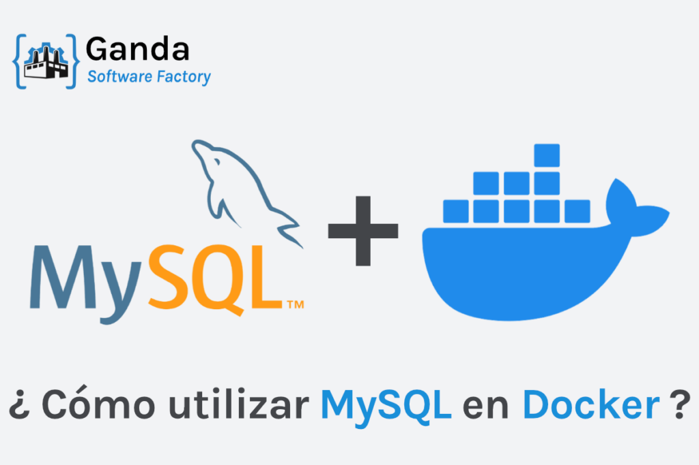
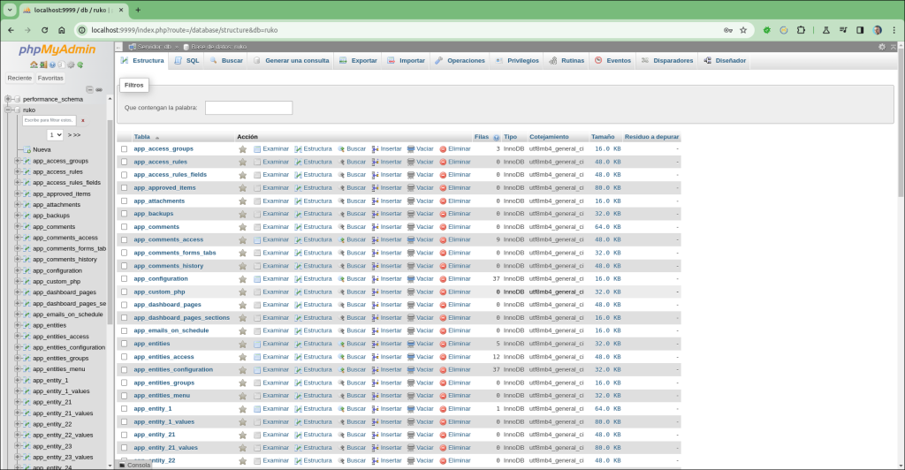
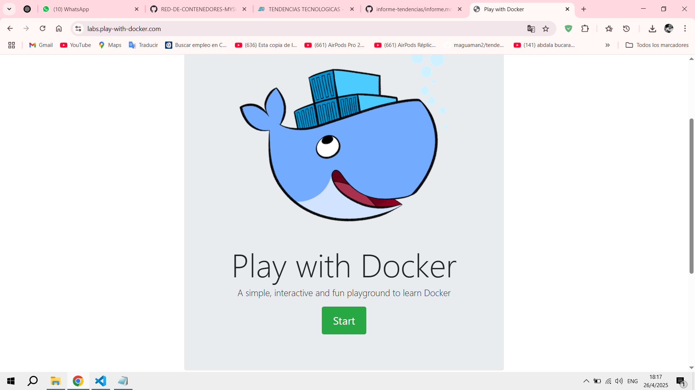
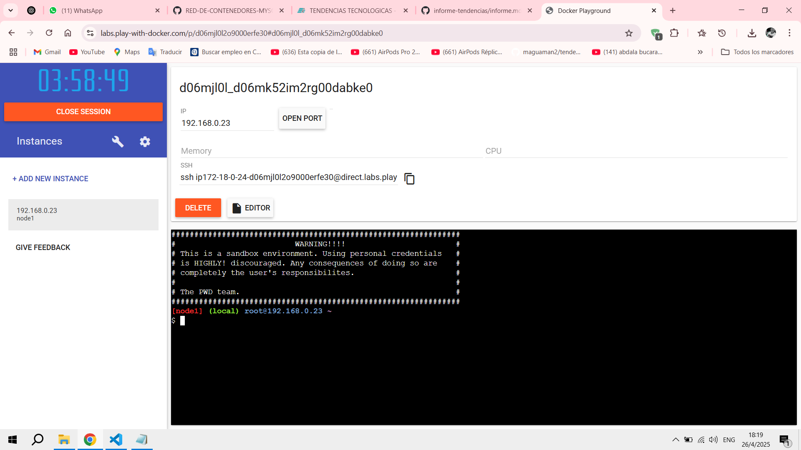
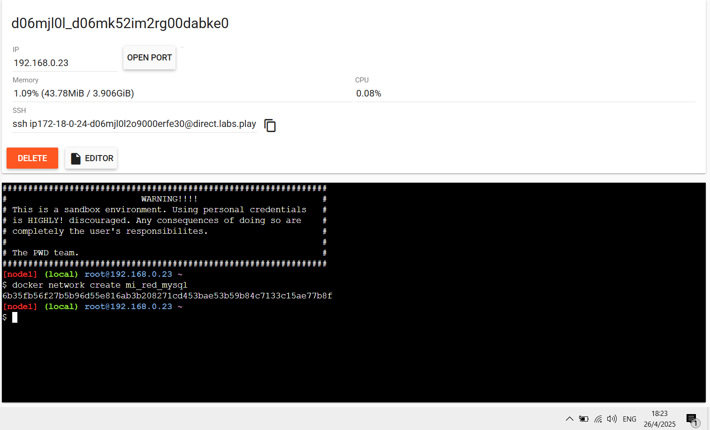
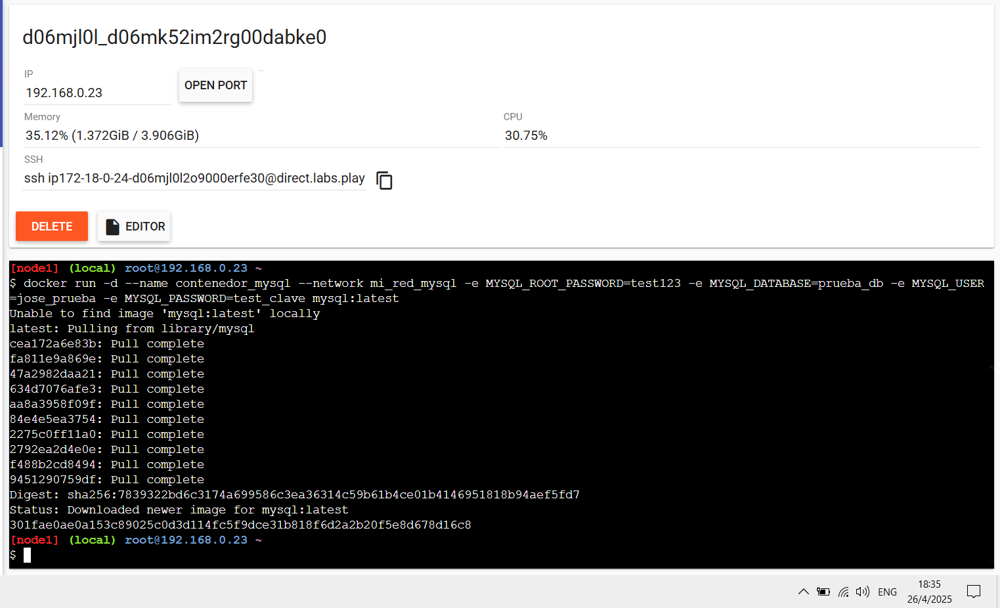
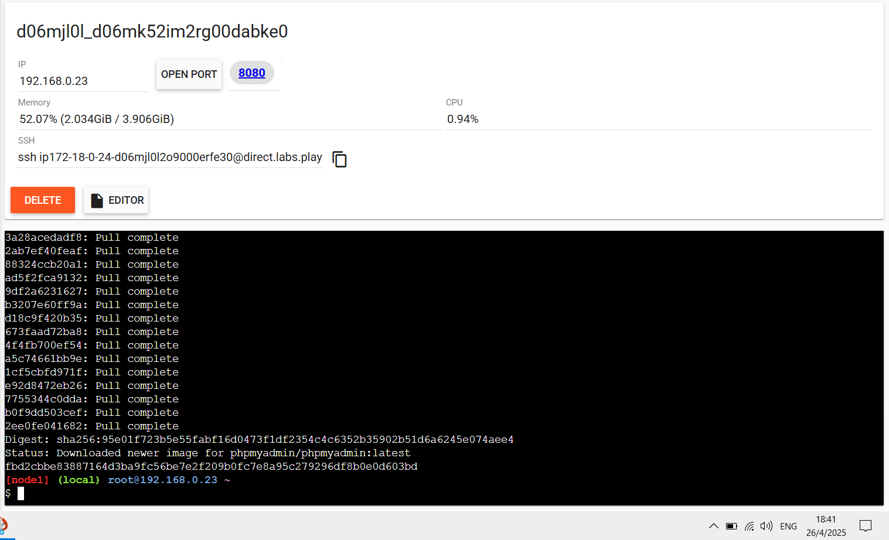
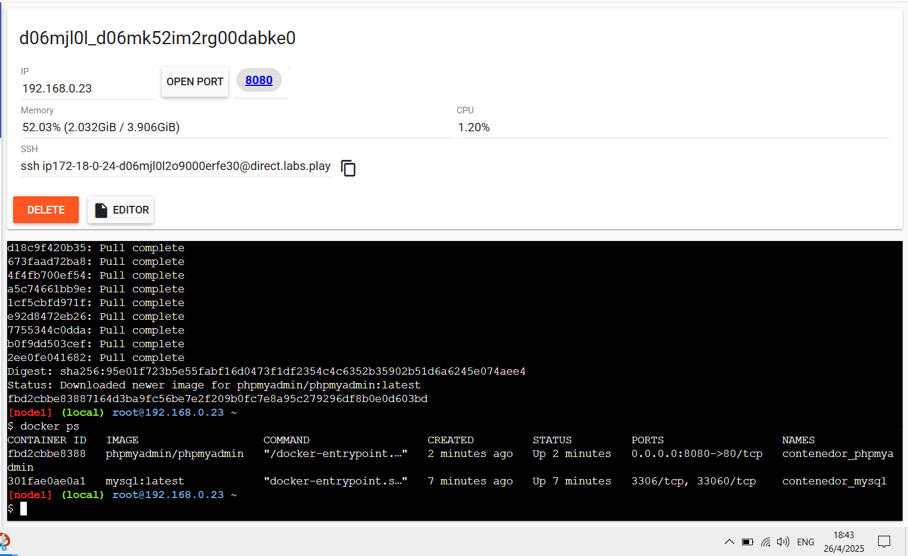
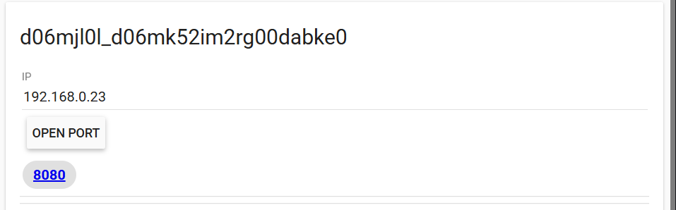
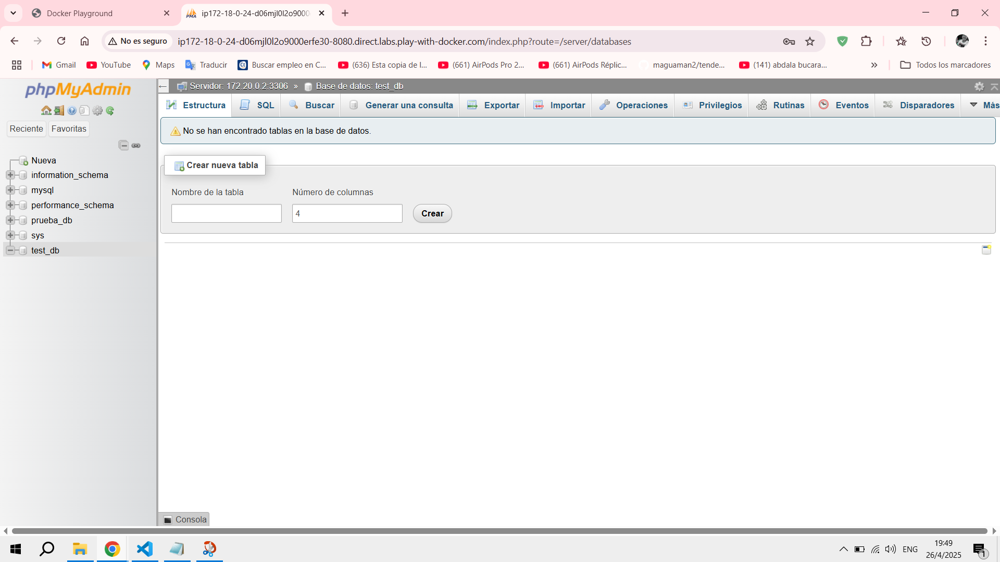

# Practica Red de contenedores MySQL y phpMyAdmin
## 1. Título.
Crear dos contenedores, uno para MySQL y otro para phpMyAdmin, y establecer una red que permita la comunicación entre ambos.
## 2. Tiempo de duración.
Docker cambió las reglas del juego en el mundo del desarrollo y la infraestructura de software. Permite levantar contenedores, que son ambientes aislados donde las aplicaciones pueden correr como si estuvieran en su propio mini-sistema operativo.
En esta práctica, el objetivo es demostrar cómo se puede orquestar dos servicios dependientes —MySQL (una base de datos relacional) y phpMyAdmin (una herramienta de administración web para MySQL)— usando contenedores interconectados mediante una red personalizada de Docker.

MySQL actuará como servidor de bases de datos, mientras que phpMyAdmin será la interfaz gráfica para administrar esas bases. La comunicación entre ambos será posible gracias a una red interna en Docker, simulando una pequeña arquitectura de microservicios.

Esta práctica es fundamental para entender los principios de:

* Contenerización de servicios

* Redes en Docker

* Administración de bases de datos remotas

* Despliegue de soluciones rápidas en entornos controlados

### Imagen referencial de MySQL y Docker.



### Imagen referencial de phpMyAdmin



## 4. Conocimientos previos.
Para llevar a cabo esta práctica, el estudiante debe tener conocimientos sobre:
* **Conocimientos básicos de Docker:**

* ¿Qué es un contenedor?

* ¿Qué es una imagen?

* Comandos principales de Docker: ```docker run```, ```docker network``` ```create```, ```docker ps```, ```docker exec```, etc.
* **Uso básico de terminal CLI:**

* Familiaridad con comandos en Linux o CMD/Powershell en el caso de Windows.

* **Manejo de navegadores web:**

* Saber acceder a servicios web vía IP o puerto.

* **Conceptos de redes básicas:**

* Entender qué es una IP local, qué es un puerto.

* **Bases de datos:**

* Saber qué es una base de datos, qué es un usuario y contraseña de conexión.

## 5. Objetivos a alcanzar.
* Implementar un contenedor MySQL configurado correctamente.

* Implementar un contenedor phpMyAdmin accesible vía navegador.

* Crear y administrar una red personalizada en Docker.

* Verificar la comunicación entre contenedores.

* Crear una base de datos de prueba desde la interfaz de phpMyAdmin.

## 6. Equipo necesario.
* Computador con sistema operativo Windows/Linux/Mac, etc.
* Acceso a Docker instalado o cuenta activa en Docker Play.
* Conexión a internet.
* Navegador web actualizado. 

## 7. Material de apoyo.
* Versión de Docker recomendada: Docker CE (Community Edition) v20.x.x o superior

* **Documentación oficial:**

* Documentación Docker

* Docker Hub MySQL

* Docker Hub phpMyAdmin

* **IDE como VSCode, WebStorm, etc**

## 8. Procedimiento.
### Paso 1: **Entrar a Docker Playground**



*Figura 1-1*: Docker Playground.

En este caso vamos a estar usando Docker Play, ya que consume menos recursos y es más fácil.

### Paso 2: **Creamos una instancia de servidor**



*Figura 1-2*: Creación de nueva instancia en Dockerplay.

Hacemos click en el botón azul que dice ```ADD NEW INSTANCE```

### Paso 3: **Crear una red Docker**
Ejecutamos este comando en la terminal de docker
```
docker network create mi_red_mysql
```


*Figura 1-3*: Creación de una red para MySQL

### Paso 4: **Crear el contenedor de MySQL**
Ejecutamos este comando en la terminal de docker
```
docker run -d --name contenedor_mysql --network mi_red_mysql -e MYSQL_ROOT_PASSWORD=test123 -e MYSQL_DATABASE=prueba_db -e MYSQL_USER=jose_prueba -e MYSQL_PASSWORD=test_clave mysql:latest
```

 

*Figura 1-3*: Descarga correcta de la imagen de MySQL

### Paso 5: **Crear el contenedor de phpMyAdmin**
Ejecutamos este comando en la terminal de docker:
```
docker run -d --name contenedor_phpmyadmin --network mi_red_mysql -e PMA_HOST=contenedor_mysql -e PMA_PORT=3306 -p 8080:80 phpmyadmin/phpmyadmin
```


*Figura 1-3*: Descarga correcta de la imagen de phpMyAdmin

### Paso 6: **Verificar que ambos contenedores esten corriendo**
Ejecutamos lo siguiente en la terminal:
```
docker ps
```


*Figura 1-4*: Los contenedores de MySQL y phpMyAdmin corriendo correctamente

### Paso 7: **Abrir phpMyAdmin desde el navegador**
Hacemos clic en el botón que dice 8080 u OPEN PORT



*Figura 1-4*: Puerto 8080 en donde esta corriendo phpMyAdmin

### Paso 8: **Iniciar sesión en phpMyAdmin**
Ingresamos los datos que creamos anteriormente que serían: Usuario: ```root``` y Contraseña: ```test123```

*Usamos el usuario **root** para poder crear bases de datos, ya que con el otro user, no tenemos permisos para crear bases de datos en phpMyAdmin*

### Paso 9: **Crear una base de datos de prueba**
Hacemos click en **Nueva** en el menú lateral izquierdo, ponemos el nombre de la base de datos: ```test_db``` y listo. 



*Figura 1-5*: Base de datos ```test_db``` creada correctamente. 

## 9. Resultados esperados.
Al finalizar esta práctica se obtuvieron los siguientes resultados:

* **Creación exitosa de una red personalizada en Docker**

* **Confirmar que la red mi_red_mysql esté activa usando ``docker network ls.``**

* **Los contenedores de MySQL y phpMyAdmin conectados a la misma red.**

* **MySQL iniciado con los credenciales personalizados ```root``` y ```jose_prueba```**

* **Despliegue de un contenedor phpMyAdmin accesible vía navegador**

* **Inicio de sesión utilizando tanto el usuario jose_prueba como el usuario root**

* **Visualización de las bases de datos disponible prueba_db**


*Figura 1-6*: Conexión entre phpMyAdmin y MySQL creada correctamente, en donde se puede visualizar la base de datos ```test_db``` desde la interfaz de phpMyAdmin.

## 10. Audio explicativo.
([Link del audio explicativo](https://drive.google.com/file/d/1kBhY_0jvdfpRkLfkiJrwoy5LeBOaFdju/view?usp=sharing))

## 11. Bibliografía
- *Docker Hub MySQL (2025.)* **Recuperado de:** <https://hub.docker.com/_/mysql>

- *Docker Hub phpMyAdmin (2025).* **Recuperado de:** <https://hub.docker.com/_/phpmyadmin>

- *Docker Desktop (2025).* **Recuperado de:** <https://docs.docker.com/desktop/>


