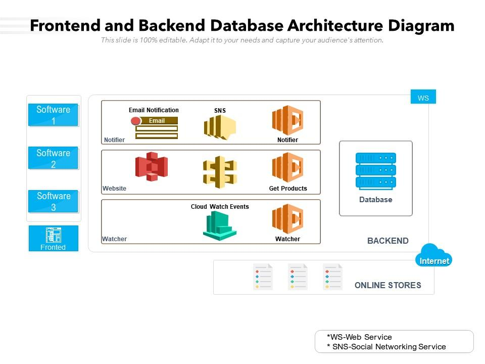
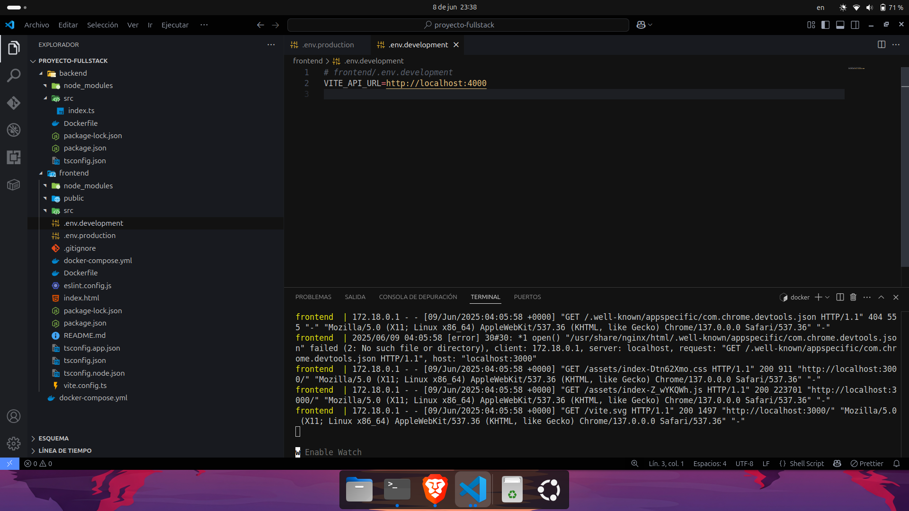
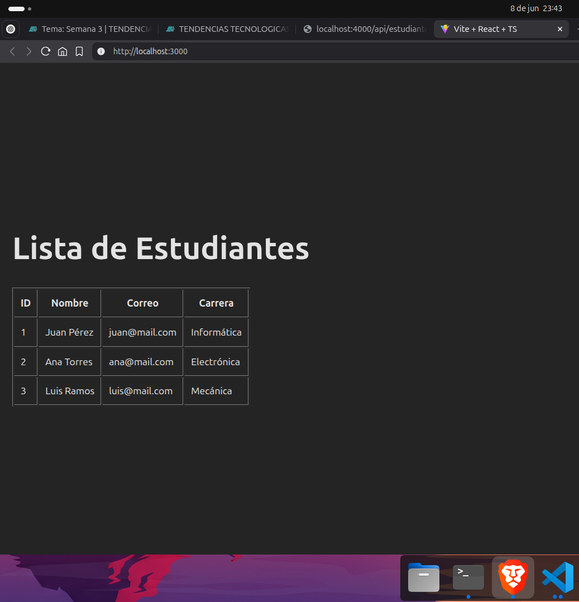
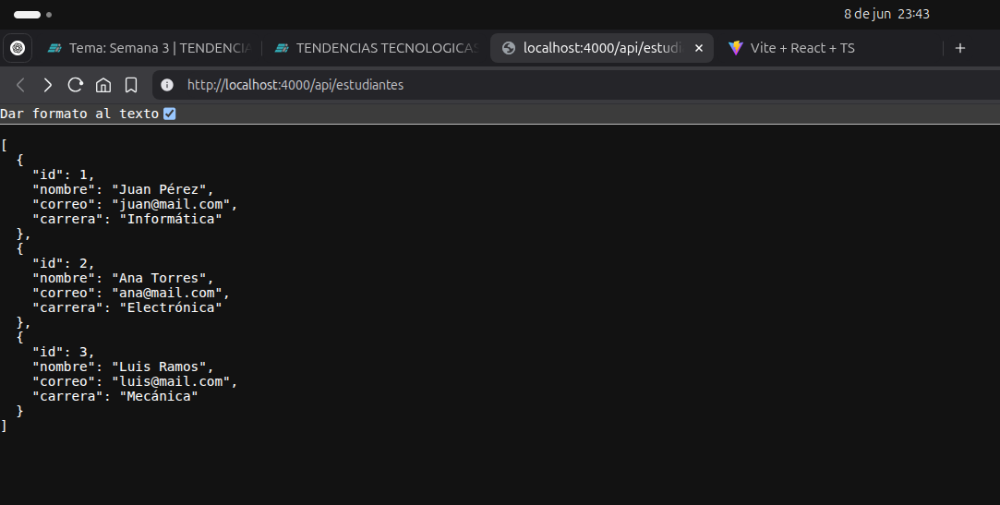

# Práctica Contenedor Backend.
## 1. Título.
Crear un contenedor Docker para una aplicación frontend desarrollada con React.
## 2. Tiempo de duración.
**Tiempo total estimado**: *60 minutos en el desarrollo del backend y 90 minutos en el desarrollo del frontend*.
## 3. Fundamentos.
**Introducción a la contenerización con Docker y despliegue de aplicaciones frontend-backend**

La práctica gira en torno a dos conceptos clave del desarrollo moderno: el uso de contenedores mediante Docker y el despliegue desacoplado de aplicaciones frontend y backend. Docker permite empaquetar aplicaciones con todas sus dependencias en contenedores ligeros y portables, lo que facilita su despliegue en cualquier entorno. En esta práctica, se construyó un sistema compuesto por dos contenedores: uno para el *frontend en React* y otro para una *API REST* desarrollada desde cero, ambos comunicándose entre sí.

Además de la teoría base de Docker, esta práctica pone a prueba conocimientos de red entre contenedores, configuración de archivos ```Dockerfile``` y ```docker-compose.yml```, y principios básicos de REST APIs.

**Diagrama de ejemplo de arquitectura (Frontend Container ⇆ Backend Container ⇆ DB)**



## 4. Conocimientos previos.
Para realizar esta práctica correctamente, el estudiante debe manejar:

* Comandos básicos de Linux/Unix ```cd```, ```ls```, ```mkdir```, ```nano```, ```chmod```, etc.

* Instalación y uso básico de Docker ```docker build```, ```docker run```, ```docker ps```, etc.

* Uso de Docker Compose

* Conceptos básicos de redes **puertos**, **IPs**, **localhost**, etc.

* JavaScript/React: Creación de componentes, ```fetch``` o ```axios``` para consumir APIs

* API REST: Conocimiento sobre endpoints HTTP **GET**, **POST**, etc.

* Manejo básico del navegador y herramientas de desarrollo **inspección**, **red**, **consola**.
## 5. Objetivos a alcanzar.
* Implementar un contenedor Docker para una aplicación React.

* Contenerizar y exponer una API RESTful personalizada.

* Configurar ```docker-compose``` para levantar ambos servicios simultáneamente.

* Establecer comunicación entre frontend y backend vía red de Docker.

* Visualizar los datos de la API en una tabla responsiva dentro del frontend.
## 6. Equipo necesario.
Computador con:

* Sistema operativo: Windows 10/11, Linux Ubuntu o macOS. 

* Editor de código: Visual Studio Code o equivalente.

* Docker Desktop instalado versión 24.x.x o superior

* Acceso a terminal o consola.

* Cuenta activa en ```https://labs.play-with-docker.com/``` para pruebas en la nube

* Navegador web.
## 7. Material de apoyo.
* Documentación oficial de Docker

* Guía de React (react.dev)

* Guía interna de la asignatura.

* Docker Cheatsheet: ```https://dockerlabs.collabnix.com/docker/cheatsheet/```

* Documentación de docker-compose: ```https://docs.docker.com/compose/```

* Postman o herramienta para probar APIs
## 8. Procedimiento.
* ### Paso 1: **Creamos el proyecto backend**
Una API Rest en Express + Typescript, con los siguientes comandos, cabe recalcar que esta práctica la desarrollo en Ubuntu:
```
cd Documentos
mkdir -p proyecto-fullstack/backend/src
cd proyecto-fullstack/backend
npm init -y
npm install express cors
npm install -D typescript ts-node-dev @types/node @types/express
```
en el directorio ```src/index.tsx``` pegamos el siguiente contenido para nuestra API
```
import express from 'express';
import cors from 'cors';

const app = express();
const port = 4000;

app.use(cors());

app.get('/api/estudiantes', (_req, res) => {
  res.json([
    { id: 1, nombre: "Juan Pérez", correo: "juan@mail.com", carrera: "Informática" },
    { id: 2, nombre: "Ana Torres", correo: "ana@mail.com", carrera: "Electrónica" },
    { id: 3, nombre: "Luis Ramos", correo: "luis@mail.com", carrera: "Mecánica" }
  ]);
});

app.listen(port, () => {
  console.log(`API escuchando en http://localhost:${port}`);
});
```
* ### Paso 2: **Creamos el proyecto frontend**
Con las tecnologías de React + Vite + Typescript, ejecutamos lo siguiente en la terminal:
```
cd Documentos
npm create vite@latest frontend -- --template react-ts
cd frontend
npm install
npm install axios
```
en la raíz del proyecto creamos un archivo ```.env.production```
```
VITE_API_URL=http://localhost:4000
```
Usamos ```localhost``` para que el navegador desde el host acceda al backend correctamente.

En el archivo principal ejecutamos los siguientes bloques de código:
```
import { useEffect, useState } from 'react';
import axios from 'axios';

interface Estudiante {
  id: number;
  nombre: string;
  correo: string;
  carrera: string;
}

function App() {
  const [estudiantes, setEstudiantes] = useState<Estudiante[]>([]);

  useEffect(() => {
    axios.get(`${import.meta.env.VITE_API_URL}/api/estudiantes`)
      .then(res => setEstudiantes(res.data))
      .catch(err => console.error('Error al cargar estudiantes:', err));
  }, []);

  return (
    <div style={{ padding: '20px' }}>
      <h1>Lista de Estudiantes</h1>
      <table border={1} cellPadding={10}>
        <thead>
          <tr>
            <th>ID</th>
            <th>Nombre</th>
            <th>Correo</th>
            <th>Carrera</th>
          </tr>
        </thead>
        <tbody>
          {estudiantes.map(est => (
            <tr key={est.id}>
              <td>{est.id}</td>
              <td>{est.nombre}</td>
              <td>{est.correo}</td>
              <td>{est.carrera}</td>
            </tr>
          ))}
        </tbody>
      </table>
    </div>
  );
}

export default App;
```
Creamos un ```docker-file.yml``` en la raíz de los dos proyectos, y ejecutamos lo siguiente: 
```
services:
  backend:
    build: ./backend
    container_name: backend
    ports:
      - "4000:4000"
    networks:
      - fullstack-net

  frontend:
    build: ./frontend
    container_name: frontend
    ports:
      - "3000:80"
    depends_on:
      - backend
    networks:
      - fullstack-net

networks:
  fullstack-net:
```
Levantamos los contenedores, y tanto el frontend como el backend, ya que estan en la misma carpeta principal ```proyecto-fullstack```
```
docker compose down
docker compose up --build
```
Navegamos hacia
* ```http://localhost:3000``` = **frontend**.
* ```http://localhost:4000/api/estudiantes``` = **backend**.



*Figura 1-1*: Estructura de carpetas del proyecto.

## 9. Resultados esperados.
Al finalizar la práctica, el sistema debe cumplir los siguientes resultados visibles y funcionales:

**1. Visualización exitosa del frontend**.


*Figura 1-2*: Aplicación React desplegada correctamente al acceder a http://localhost:3000.

El frontend muestra una interfaz con un título y una tabla con columnas: ID, Nombre, Correo, Carrera.


**2. Consumo correcto de la API**.



*Figura 1-3*: La tabla dinámicamente poblada con los datos que entrega el backend; no debe existir errores en consola relacionados a ```CORS```, ```Network Error```, o rutas incorrectas.

El navegador debe ser capaz de hacer una petición GET a:
```http://localhost:4000/api/estudiantes```
y obtener una respuesta JSON con los datos esperados.

**3. Contenedores funcionando en conjunto**
Al ejecutar ```docker compose up --build```, se levantan al dos contenedores:

* ```backend``` para el servidor Express.

* ```frontend``` sirve los archivos generados por Vite usando Nginx.

* La comunicación entre contenedores debe ser transparente a través de una red definida por Docker Compose.

**4. Accesibilidad de la API**
La API responde correctamente en ```http://localhost:4000/api/estudiantes``` incluso si se accede desde el navegador directamente.
## 10. Audio explicativo.
[Link del Audio explicativo](https://drive.google.com/file/d/1uN4DuJ9SRZ5Y797cVPsagsGBtTz5tmQW/view?usp=sharing)
## 11. Bibliografias.
- *React Documentation (2025).* **Recuperado de**: <https://react.dev/learn>

- *Vite – Next Generation Frontend Tooling (2025).* **Recuperado de**: <https://vitejs.dev/guide/>

- *TypeScript Handbook (2025).* **Recuperado de**: <https://www.typescriptlang.org/docs/>

- *Express.js API Reference (2025).* **Recuperado de**: <https://expressjs.com/en/5x/api.html>

- *Docker Docs: Containerize your applications (2025).* **Recuperado de**: <https://docs.docker.com/get-started/>

- *Docker Compose Reference (2025).* **Recuperado de**: <https://docs.docker.com/compose/compose-file/>

- *Axios HTTP Client (2025).* **Recuperado de**: <https://axios-http.com/docs/intro>

- *Documentación oficial de Node.js (2025).* **Recuperado de**: <https://nodejs.org/en/docs>