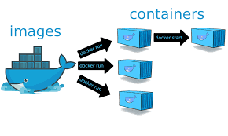
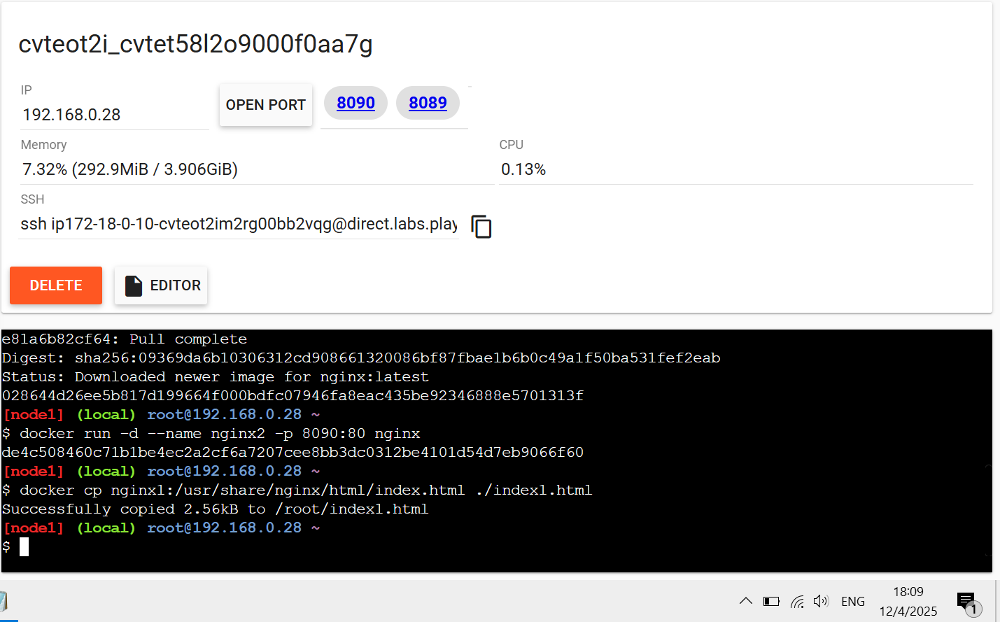

# Práctica Servidor web
## 1. Título.
Crear y personalizar dos servidores web con Nginx usando Docker.
## 2. Tiempo de duración.
- **Día 1 Exploración y configuración inicial : 40 minutos.**
* Revisión de conceptos fundamentales

* Preparación del entorno Docker

* Creación de las carpetas para los servidores

* Descarga y ejecución inicial de contenedores NGINX
- **Día 2 Personalización y verificación: 50 minutos.**
* Edición del contenido HTML en cada contenedor

* Verificación del correcto despliegue

* Documentación de la práctica
### Tiempo total: 90 minutos.
## 3. Fundamentos.
El despliegue de aplicaciones mediante contenedores es una práctica clave en el desarrollo moderno. Docker permite encapsular aplicaciones y sus dependencias en una imagen que puede ejecutarse en cualquier entorno con el mismo comportamiento.

NGINX es un servidor web de alto rendimiento utilizado para servir contenido estático, actuar como proxy inverso, balanceador de carga, etc. En esta práctica, se utiliza la imagen oficial de NGINX desde Docker Hub para montar dos servidores con contenido distinto.

Docker trabaja con un sistema cliente-servidor. Usamos el comando docker run para lanzar contenedores basados en imágenes como la de NGINX. El contenido web se monta desde el sistema host usando volúmenes, lo que permite personalizar el index.html de cada servidor.

* **Contenedor** = Mini servidor autónomo.
* **NGINX** = El que muestra las páginas
* **Docker** = El que lo monta todo como si fuera LEGO.


### Imagen referencial Docker.


### Imagen referencial Nginx.



### Imagen referencial contenedores docker.

## 4. Conocimientos previos.
Para llevar a cabo esta práctica, el estudiante debe tener conocimientos básicos en:
- **Comandos Linux:** ```cd, mkdir, ls, nano, etc.```

- **Comandos Docker:** ```docker run, docker ps, docker stop, docker rm, docker volume```

- **Navegación web y uso de puertos locales**

- **Estructura de archivos en Linux**

- **Conocimientos básicos de HTML**
## 5. Objetivos a alcanzar.
- Implementar contenedores que utilicen la imagen oficial de NGINX para servir contenido web.

- Personalizar el contenido HTML dentro de cada contenedor.

- Entender cómo funcionan los volúmenes para mapear archivos entre host y contenedor.

- Comprobar el acceso al contenido desde un navegador.

- Documentar el proceso de manera estructurada.
## 6. Equipo necesario.
- Computador con sistema operativo Windows, Linux o MacOS

- Navegador web moderno como Chrome, Firefox, etc.

- Cuenta en Docker Play, si es que no se instala localmente

- Docker versión 23.xx o superior instalado

- Editor de texto simple como VSCode

- Conexión estable a Internet.
## 7. Material de apoyo.
- Documentación oficial de Docker
- Guía de la asignatura video tutoriales de apoyo por parte del docente
- Cheat Sheet de comandos Linux
- Documentación oficial de NGINX

- Videos introductorios en YouTube sobre Docker y NGINX
## Procedimiento 8.
### Paso 1: **Entrar a Docker Playground**
Iniciamos sesión y si no tenemos cuenta procedemos a crearnos una.

### Paso 2: **Crear un entorno**
Una vez que entremos al sitio hacemos click en el boton ```start``` para comenzar.


*Figura 1-1*: Iniciando la creación del entorno en docker playground.

Luego hacemos clic en “Add New Instance” para crear un servidor Linux virtual para trabajar, se abrirá un terminal listo para usar Docker.


*Figura 1-2*: Entorno en el cual se desarrollaran los dos servidores Nginx 1 y 2.

### Paso 3: **Creamos los dos contenedores**
Una vez añadida la nueva instancia procedemos a crear el primer contenedor en la terminal de Docker Playground ejecutando el siguiente comando:
```
docker run -d --name nginx1 -p 8089:80 nginx
```
Ahora, procedemos a ejecutar el siguiente comando para crear el segundo contenedor:
```
docker run -d --name nginx2 -p 8090:80 nginx
```
Una vez ejecutados los dos comandos deberíamos ver dos botones “8089” y "8090". Esos serán nuestros accesos al nuestros primeros servidores web.


*Figura 1-3*: CLI de docker en donde se esta configurando los dos servidores.

### Paso 4: **Copiar el index.html desde el contenedor nginx1 al host**
En la misma terminal ejecutamos el siguiente comando para crear el archivo index1.html en nuestro entorno de Docker Playground: 
``` 
docker cp nginx1:/usr/share/nginx/html/index.html ./index1.html
```


*Figura 1-4*: Creación del archivo html para insertar la información institucional y estudiantil.

### Paso 5: **Editamos el index1.html con información institucional**
*Si Docker Playground no tiene nano preinstalado por defecto, ejecutamos el siguiente comando en la terminal*
```
apk add nano
```
Ahora si ejecutamos el siguiente comando para editar el html de la información académica:
```
nano index1.html
```
Borramos el html que viene por defecto y creamos uno nuevo a nuestro estilo, luego para guardar el nuevo html aplastamos ```Ctrl + o``` y finalmente para salir ```Ctrl + X```.
### Paso 6: **Subir nuestro index1.html al contenedor nginx1**
Ejecutamos el siguiente comando en la terminal: 
```
docker cp index1.html nginx1:/usr/share/nginx/html/index.html
```
Para poder ver el resultado del servidor institucional aplastamos en el boton 8089:


*Figura 1-5*: Contenedor de información institucional.

### **Paso 7: Repetimos los mismos pasos como lo hicimos en el servidor Nginx1**
*Copiamos el index.html desde nginx2 al host:*
```
docker cp nginx2:/usr/share/nginx/html/index.html ./index2.html
```
*editamos el html con la información referente a un estudiante, ejecutamos el siguiente comando:*
```
nano index2.html
```
*Lo editamos a conveniencia nuestra y lo guardamos con ```Ctrl + o``` y salimos con ```Ctrl + x```*
*subimos el archivo editado con el siguiente comando:*
```
docker cp index2.html nginx2:/usr/share/nginx/html/index.html
```


*Figura 1-6*: Contenedor de información estudiantil. 
## 9. Resultados esperados
Con la finalización de esta práctica, se desplegó exitosamente dos servidores web independientes usando contenedores Docker basados en la imagen oficial de NGINX. Cada servidor muestra contenido personalizado:

Servidor 1 ```puerto 8089:``` Información institucional del instituto.

Servidor 2 ```puerto 8090:``` Información personal del estudiante.


*Figura 1-7*: Contenedor nginx1 corriendo en puerto **8089** con contenido institucional:


*Figura 1-8*: Contenedor nginx2 corriendo en puerto **8090** con contenido personal de un estudiante en particular:

Esto permite comprobar el uso de volúmenes para modificar el contenido servido por NGINX y entender el funcionamiento básico de contenedores web.
## 10. Audio explicativo
[Link del audio explicativo](https://drive.google.com/file/d/1qTz_8VBAiKLS-pXEGWZwkO25maMjpY-7/view?usp=sharing)
## 11. Bibliografía
- *Docker Desktop (2025).* **Recuperado de:** <https://docs.docker.com/desktop/>
- *Gustavo B. (2025).* **Recuperado de:** <https://www.hostinger.com/es/tutoriales/que-es-nginx>
- *Nginx documentation (s.f).* **Recuperado de:** <https://nginx.org/en/docs/>
- *Comandos Docker: ejemplos y funciones (2025)* **Recuperado de:** <https://www.hostinger.com/es/tutoriales/comandos-docker>


