# Práctica Despliegue backend con base de datos local
## 1. Título.
Automatizar el despliegue de una aplicación backend utilizando Docker y Docker Compose.
## 2. Tiempo de duración.
Duración estimada de la práctica: **120 minutos**
**Distribución estimada**
- Configuración inicial (PostgreSQL + pgAdmin): 30 minutos

- Dockerfile e imagen del backend: 30 minutos

- Configuración de Docker Compose: 20 minutos

- Pruebas y conexión de servicios: 20 minutos

- Implementación multi-stage build: 20 minutos
## 3. Fundamentos.
Para automatizar el despliegue de una aplicación backend utilizando Docker y Docker Compose, es fundamental entender ciertos conceptos clave relacionados con la virtualización, contenedores, redes y servicios.

**Docker**

Docker es una plataforma que permite desarrollar, enviar y ejecutar aplicaciones dentro de contenedores. Un contenedor es una unidad estándar de software que empaqueta el código y todas sus dependencias para que la aplicación se ejecute rápida y confiablemente en diferentes entornos.

**Docker Compose**

Docker Compose es una herramienta para definir y administrar múltiples contenedores Docker. A través de un archivo YAML (docker-compose.yml), se pueden orquestar varios servicios como bases de datos, backends, frontends, etc., permitiendo configurar redes, volúmenes y variables de entorno con facilidad.

**PostgreSQL y pgAdmin**

- PostgreSQL es un sistema de gestión de bases de datos relacional, muy robusto y ampliamente utilizado en aplicaciones empresariales.

- pgAdmin es una herramienta web que permite administrar PostgreSQL de forma gráfica, ideal para desarrolladores y administradores de bases de datos.

**Multi-stage builds**

La técnica de multi-stage builds permite construir imágenes Docker en varias etapas. Esto ayuda a reducir el tamaño final de la imagen y mantener el entorno limpio. Se suele usar una etapa para compilar el código y otra para ejecutar, copiando solo los artefactos necesarios al final.

**Redes y volúmenes**

Docker permite crear redes internas entre contenedores, facilitando la comunicación entre servicios como bases de datos y APIs. Los volúmenes aseguran la persistencia de datos, por ejemplo, la base de datos seguirá existiendo aunque se reinicie el contenedor.

### Ejemplo visual de un ```Dockerfile``` multi-stage.

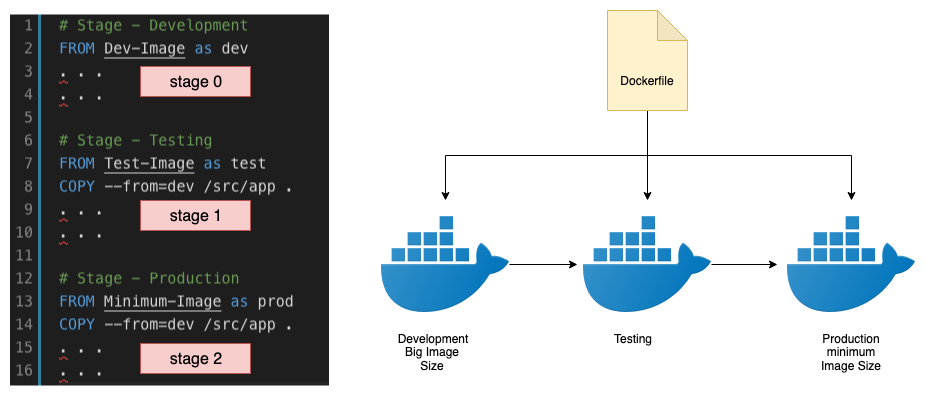

## 4. Conocimientos previos.
Para ejecutar esta práctica con soltura, es necesario tener claros los siguientes conocimientos:

- **Comandos básicos de Linux**: navegación de directorios: `*``cd```, ```ls```, manipulación de archivos ```cp```, ```mv```, ```nano```, ```vim```, permisos ```chmod```, ```chown```.

- **Navegación web**: uso de navegadores para acceder a herramientas como pgAdmin.

- **Instalación y uso de Docker y Docker Compose.**

- **Variables de entorno y archivos** ```.env```.

- **Conceptos básicos de redes (puertos, localhost, etc.)**.

- **Lectura de logs y uso de ```docker logs```.

- **Interpretación de errores de conexión entre servicios**.

- **Git básico para clonar y trabajar con repositorios**.
## 5. Objetivos a alcanzar.
- Automatizar el despliegue de una aplicación backend usando Docker.

- Crear y levantar servicios independientes para PostgreSQL y pgAdmin.

- Empaquetar el backend en una imagen Docker funcional.

- Configurar la comunicación entre contenedores usando redes internas.

- Implementar un Dockerfile optimizado utilizando ```multi-stage build```.

- Verificar persistencia de datos mediante volúmenes Docker.

- Administrar la base de datos mediante pgAdmin.
## 6. Equipo necesario. 
* Computadora con Windows / Linux / macOS

* Docker v20.x o superior

* Docker Compose v2.x o superior

* Terminal o consola: CMD, PowerShell, bash, etc.

* Cuenta en GitHub 

* Editor de texto Visual Studio Code 

* Navegador web para acceder a pgAdmin
## 7. Material de apoyo.
- Documentación oficial de Docker

- Documentación de Docker Compose

- Guía oficial de pgAdmin

Repositorio base: https://github.com/maguaman2/tendencias-mar22-security.git

- Docker Cheat Sheet

- Manual de comandos básicos de Linux
## 8. Procedimiento.
* ### Paso 1: **Instalar dependencia básicas de Docker en Ubuntu**
Comprobamos que tenemos Docker instalado correctamente

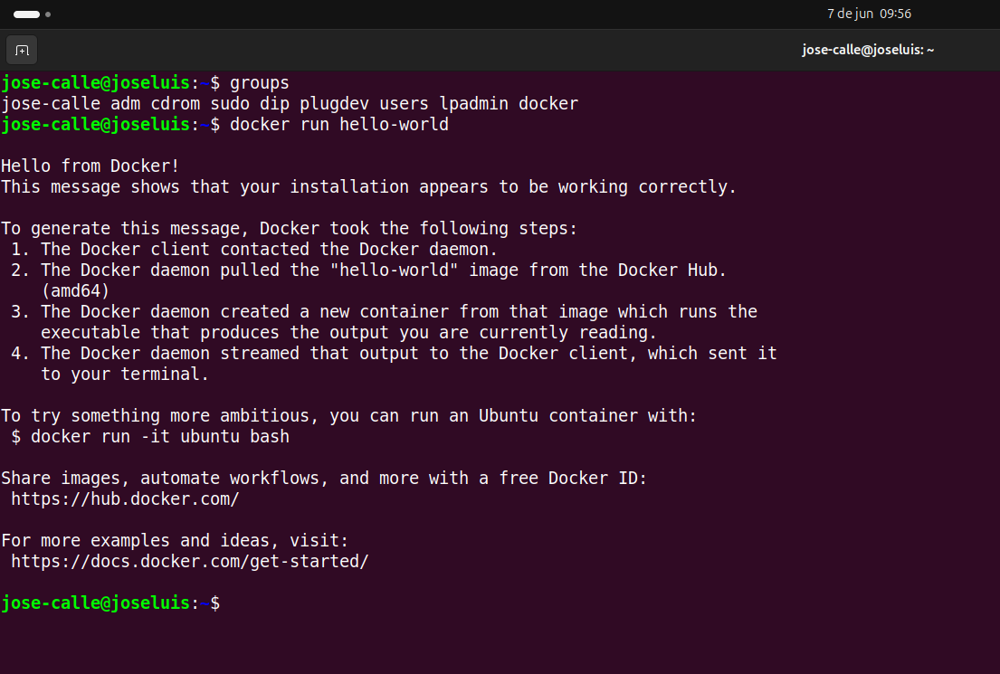

*Figura 1-1*: Docker instalado correctamente y dentro del grupo ```docker```. 

* ### Paso 2: **Clonamos el proyecto base**

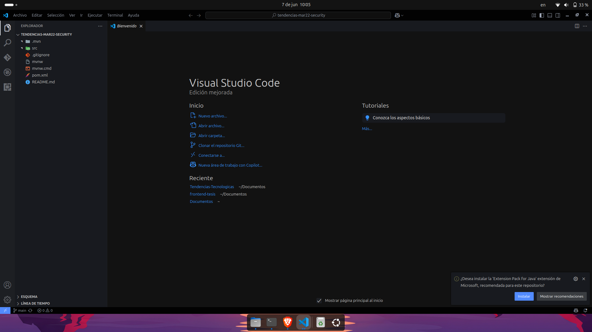

*Figura 1-2*: Repositorio clonado correctamente.

* ### Paso 3: **Creamos el archivo ```Dockerfile``` en multistage en la raíz del proyecto.

Pegamos estas lineas de codigo
```
# Etapa 1: Compilar la app
FROM maven:3.9.5-eclipse-temurin-17 AS builder
WORKDIR /app
COPY . .
RUN ./mvnw clean package -DskipTests

# Etapa 2: Imagen de ejecución
FROM eclipse-temurin:17-jdk
WORKDIR /app
COPY --from=builder /app/target/*.jar app.jar
EXPOSE 8080
CMD ["java", "-jar", "app.jar"]
```
Usamos ```maven:...``` para compilar dentro del contenedor sin depender de Maven local.

El ```./mvnw``` garantiza que se use la versión que el proyecto necesita.

En la segunda etapa solo copiamos el ```.jar``` → limpio y liviano.

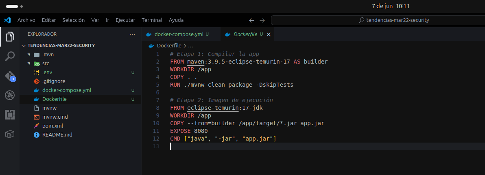

*Figura 1-3*: Creación del archivo Dockerfile

* ### Paso 4: **Creamos los archivos ```.env``` y ```docker-compose.yml```
En el archivo ```.env``` ponemos lo siguiente:
```
POSTGRES_USER=admin
POSTGRES_PASSWORD=admin123
POSTGRES_DB=appdb

PGADMIN_DEFAULT_EMAIL=admin@admin.com
PGADMIN_DEFAULT_PASSWORD=admin123

DB_HOST=postgres
DB_PORT=5432
```
y en el archivo docker-compose:
```
version: '3.8'

services:
  postgres:
    image: postgres:15
    restart: always
    environment:
      POSTGRES_USER: ${POSTGRES_USER}
      POSTGRES_PASSWORD: ${POSTGRES_PASSWORD}
      POSTGRES_DB: ${POSTGRES_DB}
    volumes:
      - pgdata:/var/lib/postgresql/data
    networks:
      - backend-net

  pgadmin:
    image: dpage/pgadmin4
    restart: always
    ports:
      - "5050:80"
    environment:
      PGADMIN_DEFAULT_EMAIL: ${PGADMIN_DEFAULT_EMAIL}
      PGADMIN_DEFAULT_PASSWORD: ${PGADMIN_DEFAULT_PASSWORD}
    depends_on:
      - postgres
    networks:
      - backend-net

  backend:
    build:
      context: .
      dockerfile: Dockerfile
    environment:
      DB_HOST: ${DB_HOST}
      DB_PORT: ${DB_PORT}
      DB_USER: ${POSTGRES_USER}
      DB_PASSWORD: ${POSTGRES_PASSWORD}
      DB_NAME: ${POSTGRES_DB}
    ports:
      - "8080:8080"
    depends_on:
      - postgres
    networks:
      - backend-net

volumes:
  pgdata:

networks:
  backend-net:
    driver: bridge
```
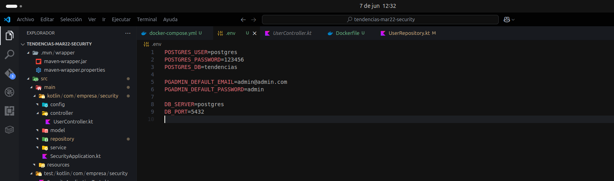
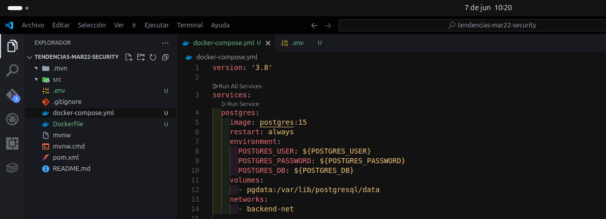

*Figura 1-4*: docker-compose.yml y .env creados correctamente.

* ### Paso 5: **Levantámos pgAdmin y postgreSQL**
Antes de levantar el proyecto, instalamos las dependencias necesarias, con ```npm install```, despues de ello levantamos todo el proyecto con el siguiente comando: 
```
docker compose up --build
```
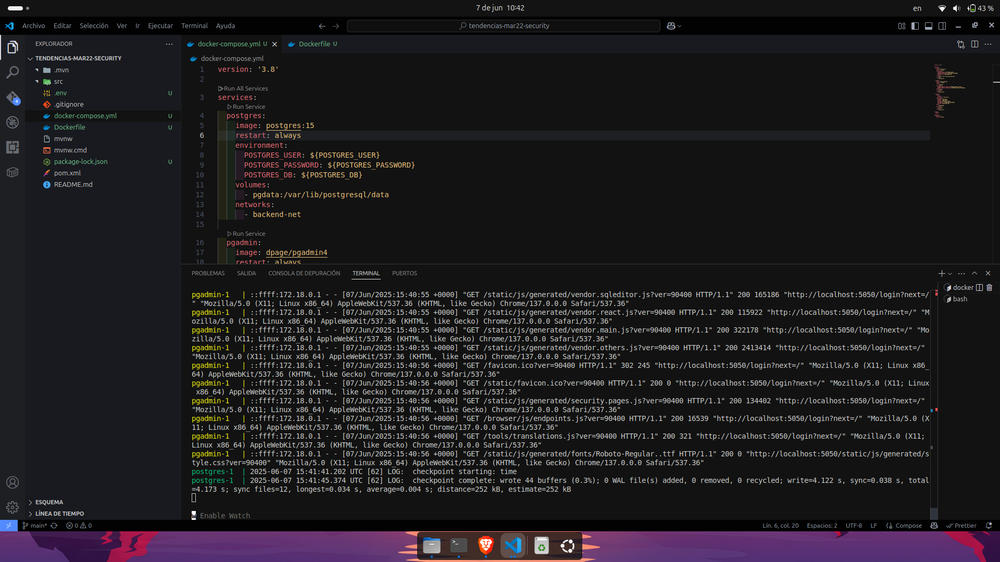
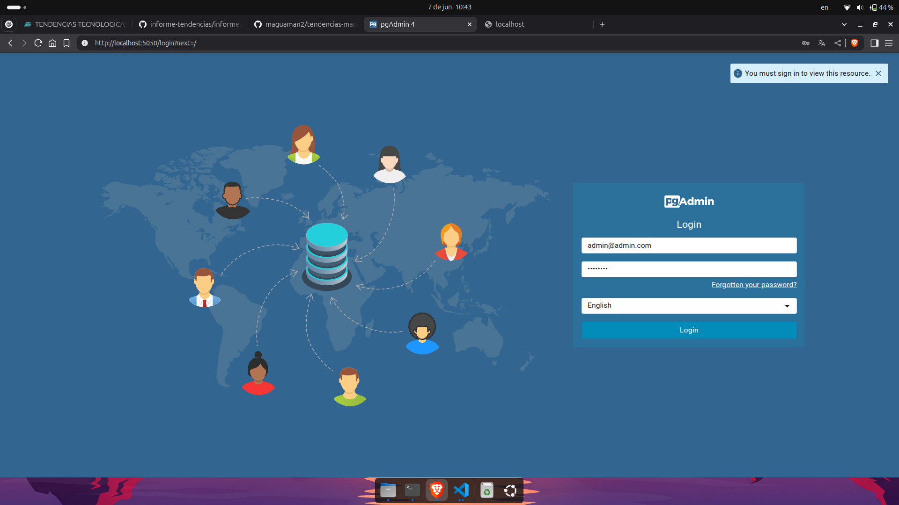

*Figura 1-5*: pgAdmin y PostgreSQL corriendo correctamente en el navegador.

* ### Paso 6: **Levantamos el backend si es que con el anterior comando no se levanta completamente**

Ejecutamos el mismo comando:
```
docker compose up --build
```
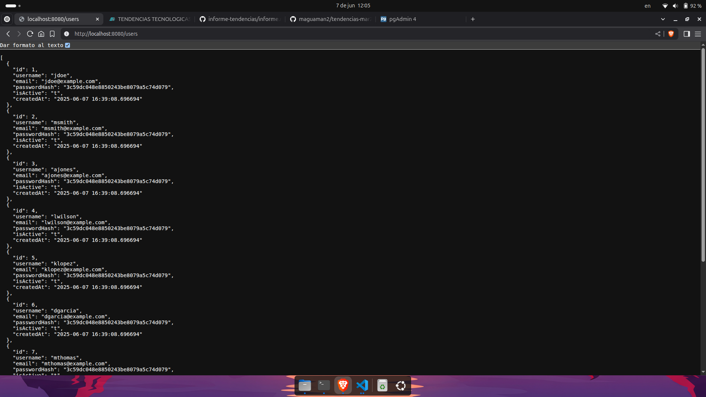
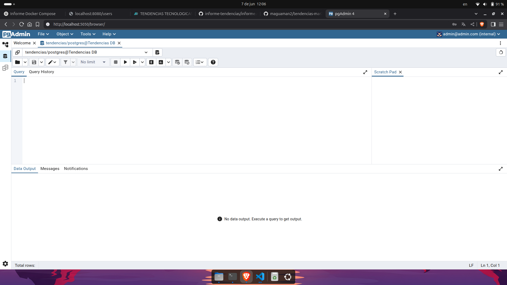

*Figura 1-6*: Backend levantado complemente en el puerto ```https://localhost:8080/users``` probando el endpoint 
```/users```

## 9. Resultados esperados.
* 1. La API REST está operativa 
se puede hacer GET ```http://localhost:8080/users``` y devuelve un 200 OK con una lista JSON de usuarios.

* Se puede hacer ```POST /users``` para crear un usuario.

* El backend está corriendo en el puerto ```8080```.

* 2. Base de datos PostgreSQL funcionando
-  El contenedor de postgres está activo.

- La base de datos tendencias existe.

- Hay al menos una tabla user poblada con datos de prueba.

- Las migraciones Flyway se ejecutaron correctamente al iniciar la app ```V1__init.sql``` fue aplicado.

* 3. pgAdmin conectado
- Puedes entrar a ```http://localhost:5050```.

- Lograr conectar al servidor ```PostgreSQL``` usando:

```Host```: postgres

```User```: postgres

```DB```: tendencias

- Desde ahí puedes ver las tablas, columnas y ejecutar consultas SQL.

* 4. Ambiente controlado por Docker
- Al correr docker compose up, todo se levanta correctamente: backend, postgres, pgadmin.

- Podemos hacer docker ps y ver los 3 contenedores corriendo.

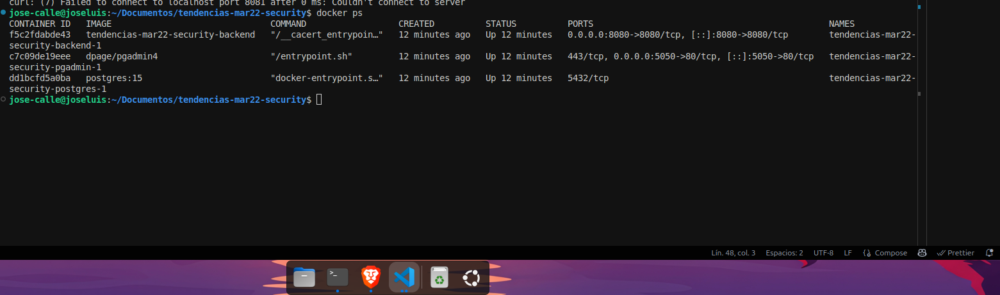

- Podemos destruir y volver a levantar el entorno sin perder configuración ```docker compose down && up```.

* 5. Buenas prácticas básicas
- Contraseñas están fuera del código usando ```.env```.

- Flyway versiona las migraciones.

- Datos sensibles como ```DB_USER```, ```DB_PASSWORD``` se pasan como variables de entorno.

## 10. Audio explicativo.
[Link del Audio explicativo](https://drive.google.com/file/d/1JQ7iar6wJ4IVsao99NgRrokblF-Hrb1_/view?usp=sharing)

## 11. Bibliografía.
- *Spring Boot Reference Documentation (2025).* **Recuperado de**: <https://docs.spring.io/spring-boot/docs/current/reference/html/>

- *Kotlin para desarrolladores de Spring (2025).* **Recuperado de**: <https://docs.spring.io/spring-framework/docs/current/reference/html/language.html#kotlin>

- *PostgreSQL: Documentación oficial (2025)*. **Recuperado de**: <https://www.postgresql.org/docs/>

- *pgAdmin 4 Documentation (2025)*. **Recuperado de**: <https://www.pgadmin.org/docs/pgadmin4/latest/>

- *Flyway Database Migration (2025)*. **Recuperado de**: <https://documentation.red-gate.com/fd>

- *Repositorio del backend desarrollado* <https://github.com/maguaman2/tendencias-mar22-security>