# Práctica WordPress con Docker Compose YML.
## 1. Título.
WordPress con PostgreSQL-PgAdmin en Docker-Compose
## 2. Tiempo de duración.
Duración total de la práctica: **60 minutos**
## 3. Fundamentos.
**¿Qué es Docker-Compose?**
Docker Compose es una herramienta que simplifica la gestión de contenedores relacionados. En lugar de correr comandos largos y complejos para cada contenedor, puedes definir todos los servicios, redes y volúmenes en un único archivo ```docker-compose.yml``` y luego simplemente ejecutar ```docker-compose up``` para iniciar todo.

**Servicios a implementar**
* **WordPress**: Plataforma de gestión de contenido CMS que permite la creación de sitios web de manera sencilla.

* **PostgreSQL**: Sistema de gestión de bases de datos relacional, robusto y ampliamente utilizado.

* **PgAdmin**: Interfaz web para gestionar bases de datos PostgreSQL de manera visual y amigable.

**¿Qué es un volúmen?**
En Docker, un volumen se usa para almacenar datos que necesitan persistir incluso si el contenedor se elimina. Esto es crucial para bases de datos como PostgreSQL, ya que perder la data cada vez que el contenedor se reinicia sería catastrófico.

* **¿Qué es una red?**
Una red en Docker permite la comunicación entre contenedores. En esta práctica, definirás una red personalizada para que WordPress pueda comunicarse con PostgreSQL y PgAdmin de forma segura y aislada del resto del sistema.

### Imagen referencial de Docker Compose.

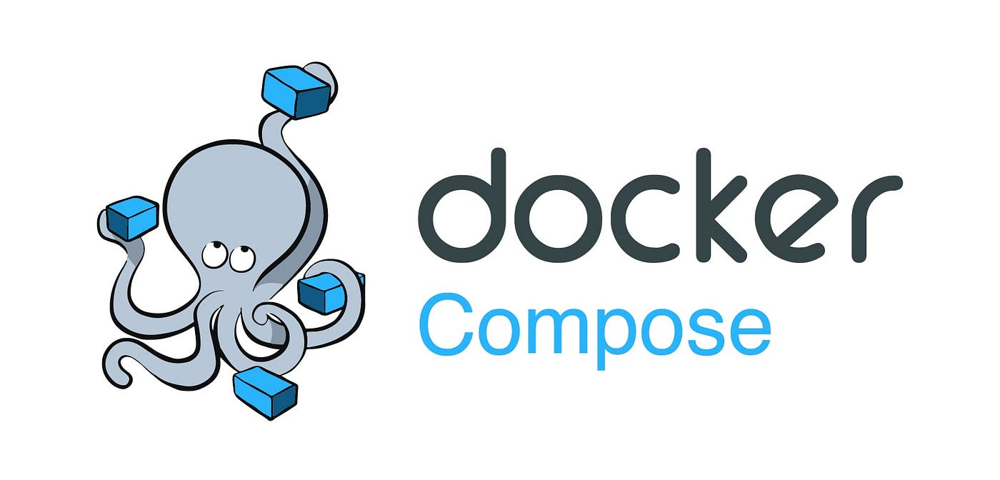

### Imagen referencial de YML.

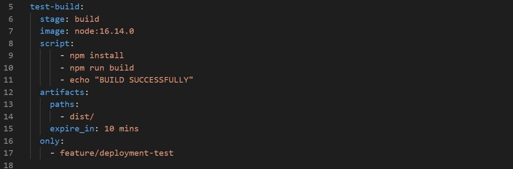

## 4. Conocimientos previos.
Para la realización de esta práctica, el estudiante necesitas tener claros los siguientes conceptos y habilidades:

* Comandos básicos de Docker y Docker Compose ```docker ps```, ```docker-compose up```. 
* Sintaxis y estructura de archivos YAML.
* Conceptos de redes y volúmenes en Docker.
* Manejo básico del navegador web para acceder a WordPress y PgAdmin.
* Conocimiento básico de sistemas de gestión de bases de datos relacionales PostgreSQL.

## 5. Objetivos a alcanzar.
* Construir un entorno multi-servicio usando ```docker-compose.yml```.

* Implementar los servicios WordPress, PostgreSQL, y PgAdmin conectados en una misma red.

* Definir y utilizar un volumen para la persistencia de datos.

* Verificar la correcta comunicación entre los servicios mediante acceso web a WordPress y PgAdmin.

## 6. Equipo necesario.
* Computadora con sistema operativo Windows / Linux / Mac.

* Acceso a Docker Play o tener Docker y Docker Compose instalados localmente.

* Editor de texto como VSCode o Notepad++.

* Conexión a Internet.

* Navegador Web actualizado Chrome, Firefox o Edge.

## 7. Material de apoyo.
* Documentación oficial de Docker Compose.

* Guía de la asignatura o laboratorio.

* Cheat Sheet de comandos de Docker y Linux.

* Documentación oficial de WordPress.

* Documentación oficial de PostgreSQL.

* Documentación oficial de PgAdmin.

## 8. Procedimiento.
* ### Paso 1: **Preparamos el entorno en Docker Play**
En mi caso, voy a estar usando Docker Playground en ves de Docker Desktop por problemas de rendimiento en mi computador.

* ### Paso 2: **Crear el archivo docker-compose.yml**
En la terminal de docker play, ejecutamos el siguiente comando, para entrar en el modo edicion de vi en docker play:
```
vi docker-compose.yml
```
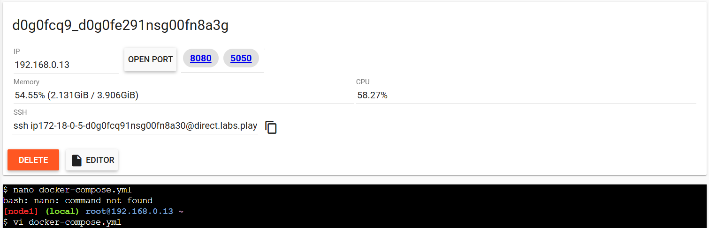

*Figura 1-1* : Comando ejecutado correctamente en el modo edición.

Una vez ejecutado el comando entramos en el formato edición pegamos el archivo ```.YML``` que vamos a usar

```
version: "3.9"

services:
  postgres:
    image: postgres:16
    restart: always
    environment:
      POSTGRES_USER: wp_user
      POSTGRES_PASSWORD: wp_password
      POSTGRES_DB: wordpress_db
    volumes:
      - postgres_data:/var/lib/postgresql/data
    networks:
      - wp_network

  pgadmin:
    image: dpage/pgadmin4
    restart: always
    environment:
      PGADMIN_DEFAULT_EMAIL: admin@admin.com
      PGADMIN_DEFAULT_PASSWORD: admin
    ports:
      - "5050:80"
    networks:
      - wp_network

  wordpress:
    image: wordpress:php8.2-apache
    restart: always
    environment:
      WORDPRESS_DB_HOST: postgres:5432
      WORDPRESS_DB_USER: wp_user
      WORDPRESS_DB_PASSWORD: wp_password
      WORDPRESS_DB_NAME: wordpress_db
    ports:
      - "8080:80"
    networks:
      - wp_network

volumes:
  postgres_data:

networks:
  wp_network:
```


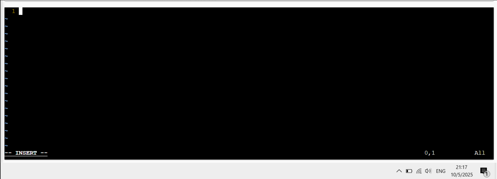

*Figura 1-2*: Se ingresó al modo edicion correctamente. 

* ### Paso 3: **Levantamos los servicios**
Ejecutamos el siguiente comando en la terminal:
```
docker-compose up -d
```
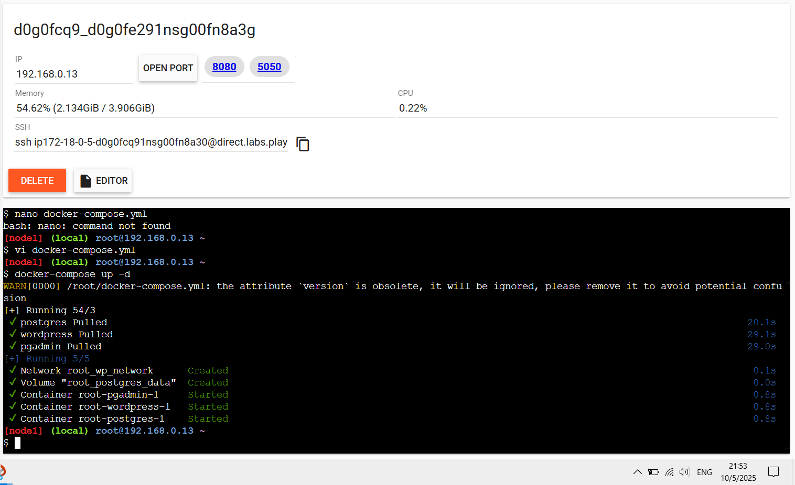

*Figura 1-3*: Todos los servicios estan corriendo correctamente en sus puertos asignados. 

* ### Paso 4: **Verficamos que los contenedores estén en ejecución**
Ejecutamos el siguiente comando en la terminal: 
```
docker ps
```

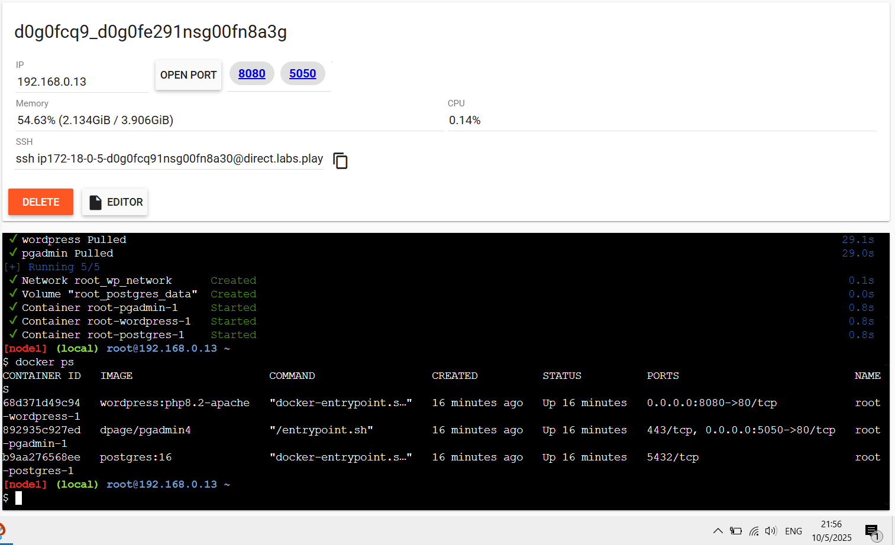

*Figura 1-4*: Todos los contenedores creados está en función correctamente. 

* ### Paso 5: **Verificamos que WordPress no nos de error de base de datos**
En este caso si nos dió un error ya que WordPress no es compatible con  PostgreSQL - PgAdmin4, ya que solo funciona con MySQL o MaríaDB. 

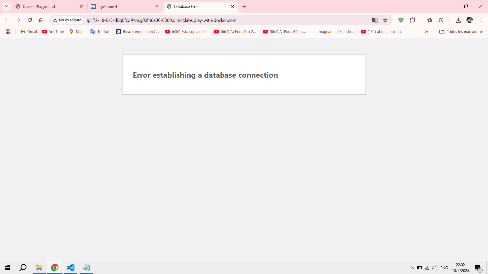

* ### Paso 6: **Solucionar el error de base de datos**
En este caso vamos a sustituit PgAdmin 4 por phpMyAdmin, y para eso modificamos el archivo .YML que habíamos creado anteriormente.
```
version: "3.9"

services:
  mysql:
    image: mysql:5.7
    restart: always
    environment:
      MYSQL_DATABASE: wordpress_db
      MYSQL_USER: wp_user
      MYSQL_PASSWORD: wp_password
      MYSQL_ROOT_PASSWORD: root_password
    volumes:
      - mysql_data:/var/lib/mysql
    networks:
      - wp_network

  phpmyadmin:
    image: phpmyadmin/phpmyadmin
    restart: always
    environment:
      PMA_HOST: mysql
      PMA_USER: root
      PMA_PASSWORD: root_password
    ports:
      - "5050:80"
    networks:
      - wp_network

  wordpress:
    image: wordpress:php8.2-apache
    restart: always
    environment:
      WORDPRESS_DB_HOST: mysql:3306
      WORDPRESS_DB_USER: wp_user
      WORDPRESS_DB_PASSWORD: wp_password
      WORDPRESS_DB_NAME: wordpress_db
    ports:
      - "8080:80"
    networks:
      - wp_network

volumes:
  mysql_data:

networks:
  wp_network:
```
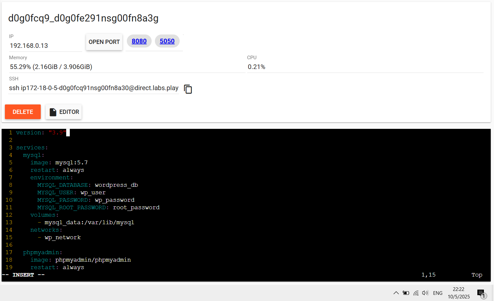

*Figura 1-5*: Corrección del archivo YML

* ### Paso 7: **Volvemos a levantar nuestros servicios**
Ejecutamos el mismo comando en la terminal:
```
docker-compose up -d
```
Para que no nos aparezca el error de PgAdmin este corriendo en el puerto ```5050``` detenemos los servicios anteriores: 

```
docker-compose down
```
y volvemos a levantar con limpieza total:

```
docker-compose up -d --remove-orphans
```
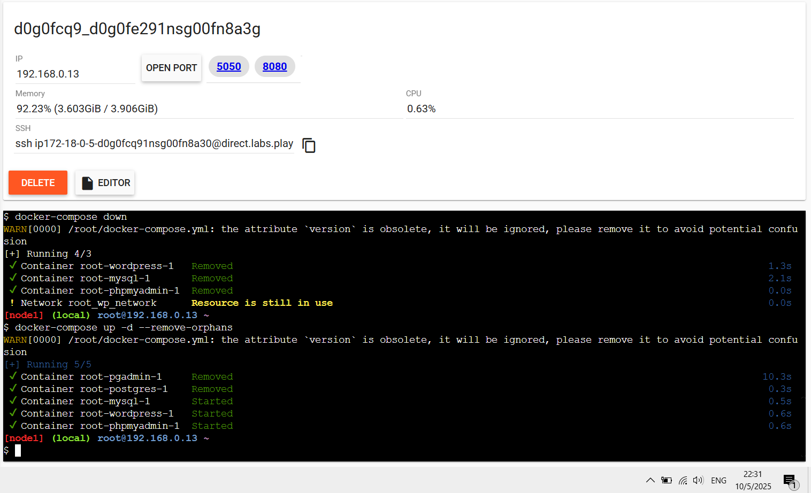

*Figura 1-6*: El contenedor de PgAdmin removido y reemplazado por phpMyAmdin correctamente. 

* ### Paso 8: **Acceder desde el navegador hacia WordPress y phpMyAdmin**
Accedemos a los servicios creados desde los puertos mostrados
* ```5050```: Para **phpMyAdmin**
* ```8080```: Para **WordPress**

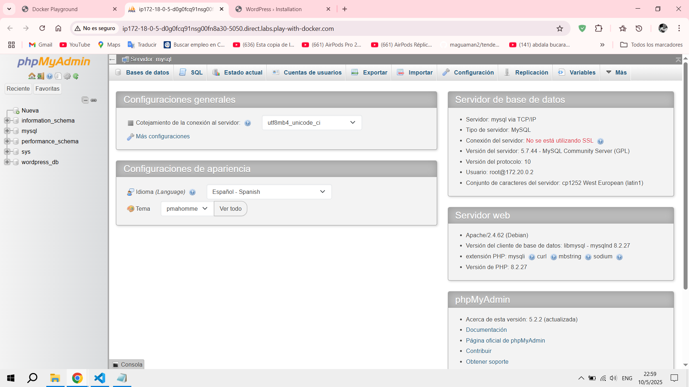

*Figura 1-7*: contenedor phpMyAdmin corriendo correctamente

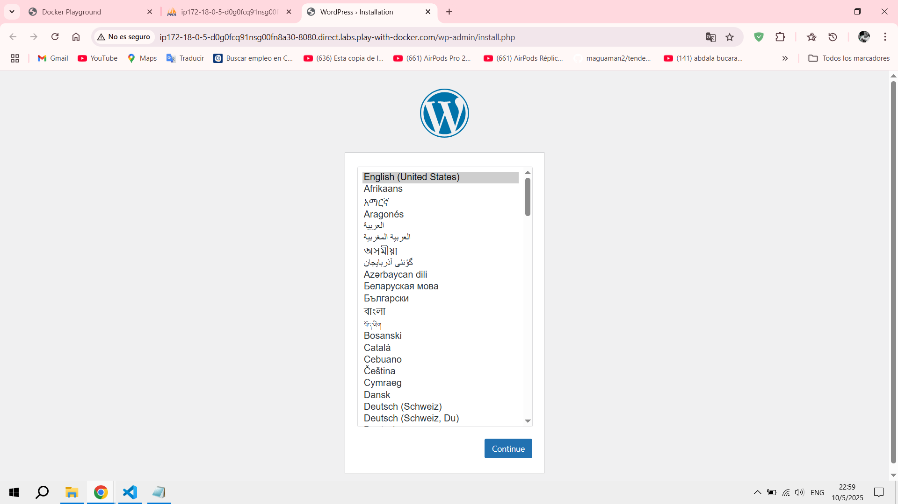

*Figura 1-8*: contenedor WordPress corriendo correctamente

## 9. Resultados esperados.
La finalización de esta práctica trae consigo:

1. **Levantar un entorno de múltiples servicios con Docker Compose, compuesto por:**
 
 - Un contenedor de MySQL ejecutando el servicio de base de datos.

- Un contenedor de phpMyAdmin para gestionar MySQL mediante interfaz web.

- Un contenedor de WordPress completamente funcional y accesible desde un navegador web.

2. Acceder exitosamente a phpMyAdmin a través del puerto ```5050```, validando:

- La existencia de la base de datos ```wordpress_db```.

- La correcta visualización de las tablas generadas por WordPress ```wp_posts```, ```wp_users```, etc.

3. Completar el asistente de instalación de WordPress, accediendo a través del puerto ```8080```, configurando:

- El idioma del sitio.

- El usuario y contraseña administrador.

- El título del sitio web.

4. Acceder al panel de administración de WordPress, asegurando que:

- La plataforma se encuentra operativa.

- Se pueden crear páginas, entradas o personalizar la apariencia.

5. Comprobar que los contenedores están corriendo de manera aislada pero interconectada en la red definida en Docker Compose, garantizando:

- Comunicación entre **WordPress** y **MySQL**.

- Acceso desde **phpMyAdmin** al motor de base de datos.

- Persistencia de los datos almacenados gracias al volumen ```mysql_data```.


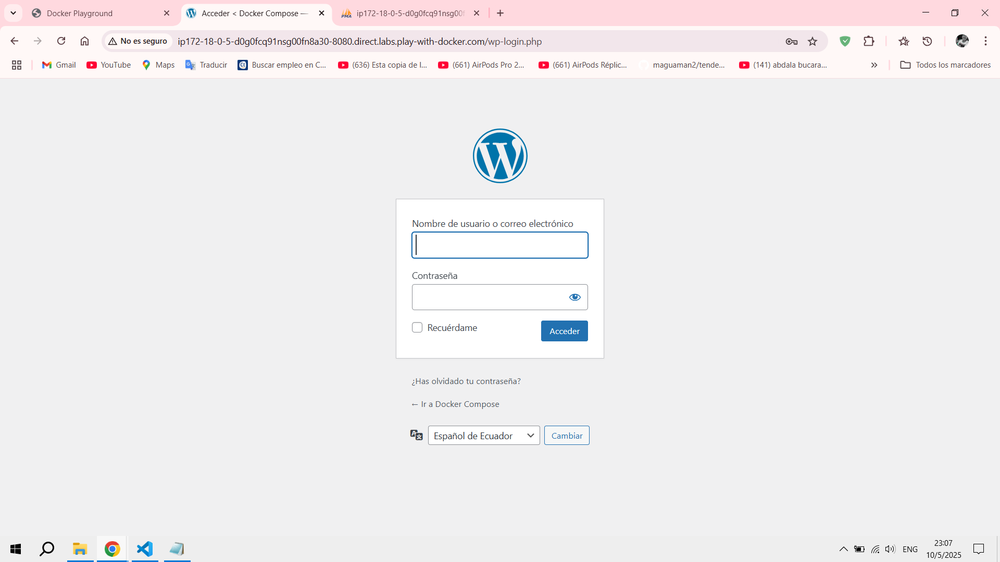

*Figura 1-9*: Servidor WordPress instalado y corriendo correctamente

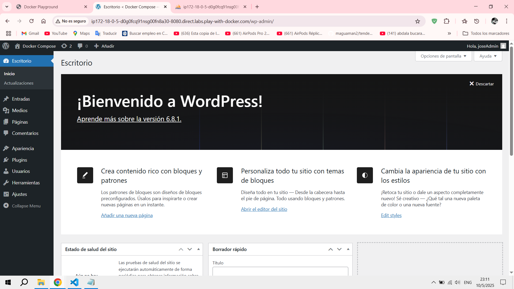

*Figura 1-10*: Dashboard de administración de WordPress

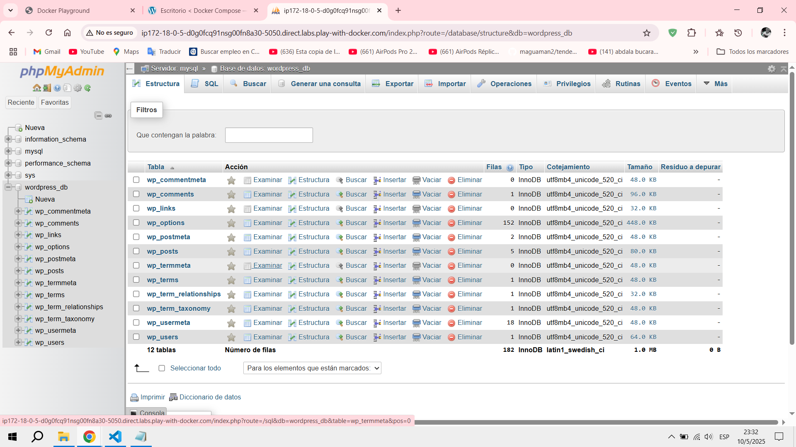

*Figura 1-11*: phpMyAdmin corriendo completamente, incluidas las tablas de relación de WordPress

## 10. Audio explicativo.
[Link del Audio explicativo](https://drive.google.com/file/d/1m5gdOaBXjcszyO1axyG7j0-dPtf-dHWi/view?usp=sharing)

## 11. Bibliografía.
- *Docker Hub MySQL (2025.)* **Recuperado de:** <https://hub.docker.com/_/mysql>

- *Docker Hub phpMyAdmin (2025).* **Recuperado de:** <https://hub.docker.com/_/phpmyadmin>

- *Docker Desktop (2025).* **Recuperado de:** <https://docs.docker.com/desktop/>

- *Primeros Pasos WordPress (2025).* **Recuperado de:**
<https://wordpress.com/es/support/category/primeros-pasos/>

- *Docker Compose (2025).* **Recuperado de:** <https://docs.docker.com/compose/> 


