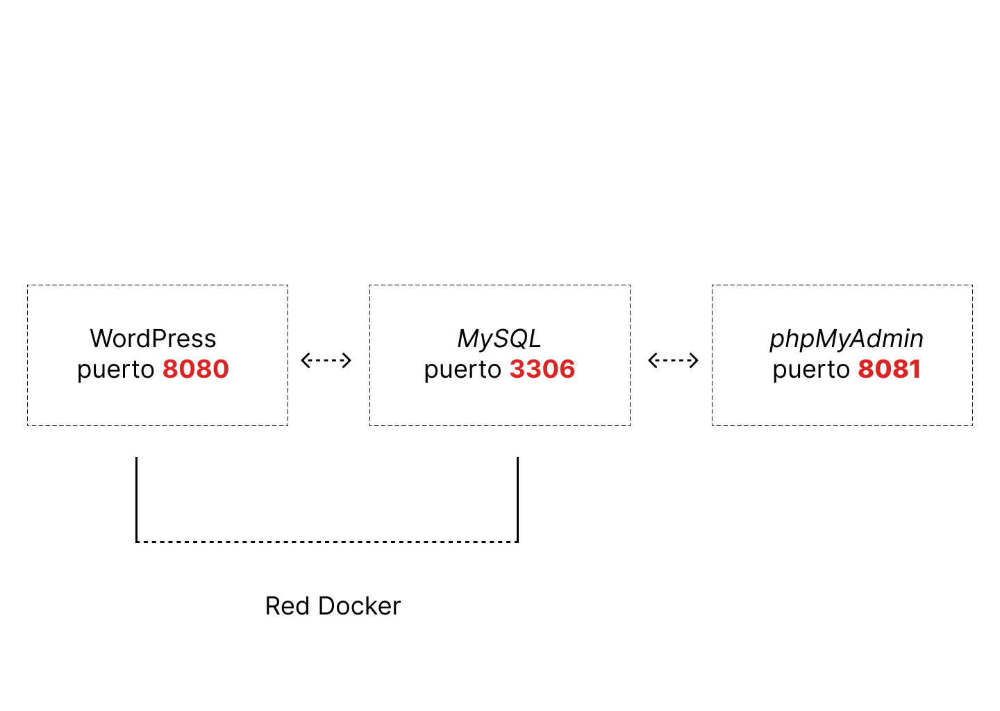
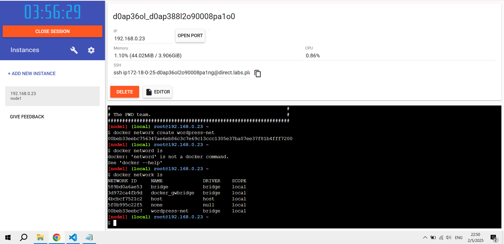
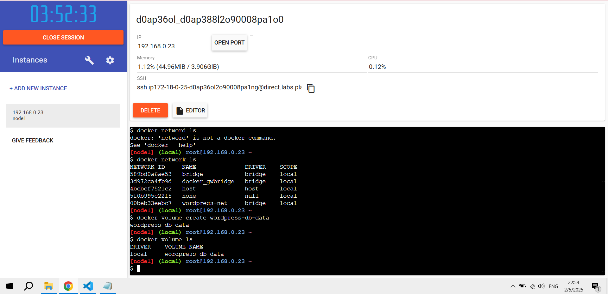
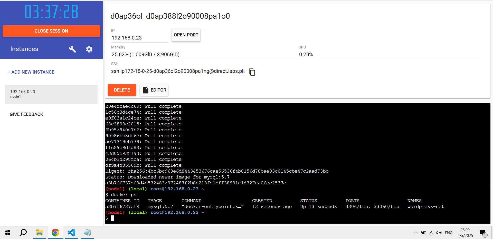
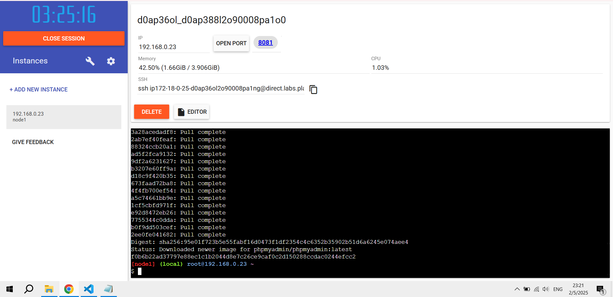
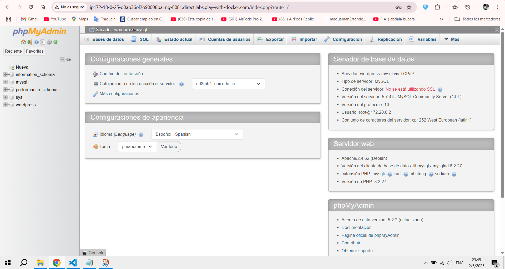
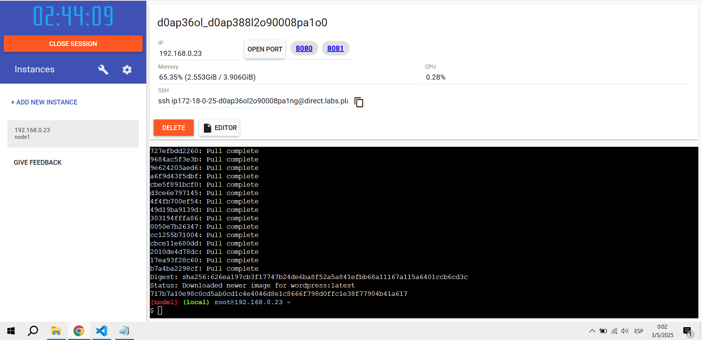
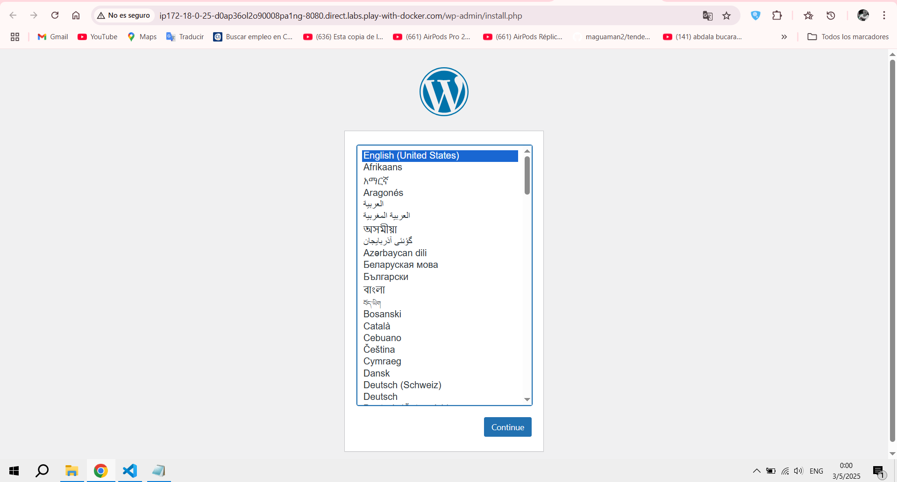
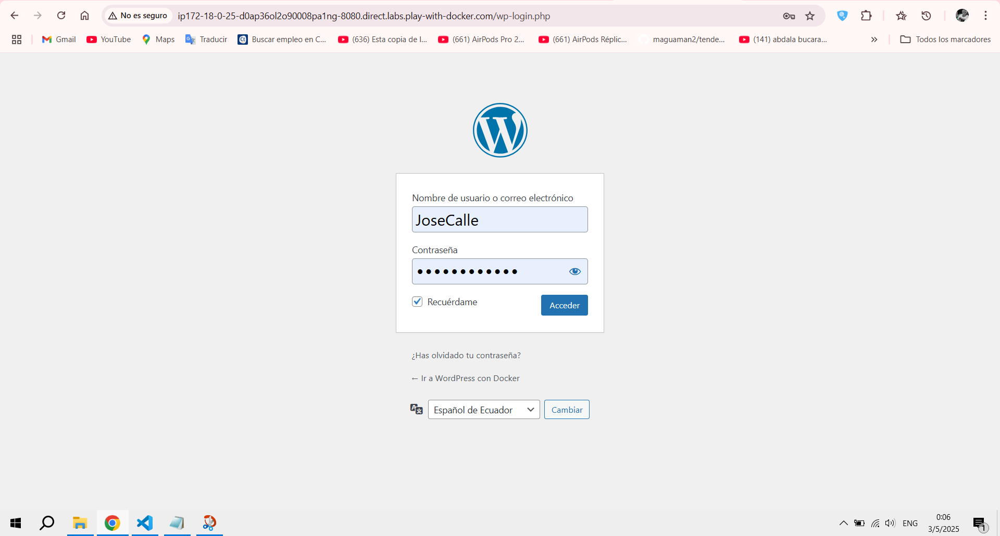
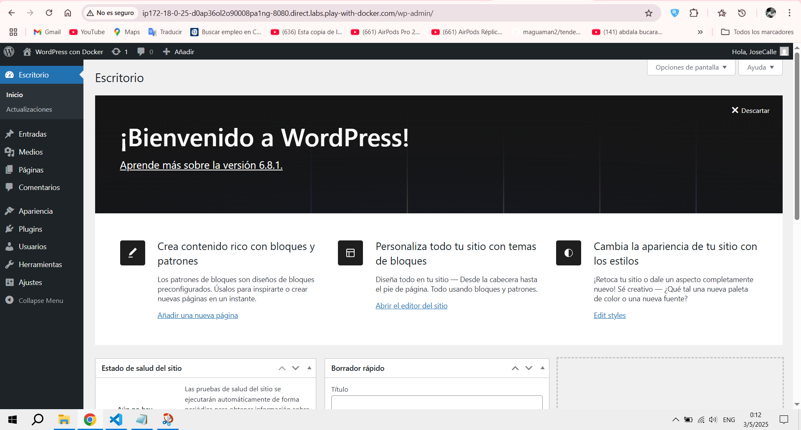

# Práctica WordPress con Docker.
## 1. Título.
Crear contenedores para un sitio WordPress, utilizando comandos de Docker.
## 2. Tiempo de duración.
Duración total de la práctica: **45 minutos.**
## 3. Fundamentos.
**¿Qué es Docker y por es importarte?**

Docker es una plataforma de contenedores. No son máquinas virtuales, son procesos aislados con todo lo necesario para correr una app. ¿Qué se gana con todo aquello? Ligereza, portabilidad, consistencia. En lugar de tener problemas sufriendo con máquinas virtuales, lo empacamos en un contenedor y listo.

**Conceptos clave**
* **Contenedor:** Unidad ejecutable y aislada que corre una app con sus dependencias.

* **Imagen:** La plantilla para crear un contenedor. Piensa en ella como el blueprint.

* **Red de Docker:** Permite que los contenedores se hablen entre sí sin necesidad de exponerlos al mundo.

* **Volumen:** Área persistente de almacenamiento. Porque los datos de una base de datos no deberían borrarse cada vez que reinicias el contenedor.

* **Docker Hub:** El repositorio central de imágenes. Como la App Store, pero para devs.

### Diagrama de los contenedores con los puertos utilizados.



## 4. Conocimientos previos.
Para llevar a cabo esta práctica, el estudiante debe tener conocimientos sobre:

* Comandos Linux básicos ```cd```, ```mkdir```, ```ls```, etc.

* Conocimientos de Docker CLI ```docker run```, ```docker network``` ```create```, etc.

* Saber usar un navegador para acceder a WordPress y phpMyAdmin.

* Entender qué es una **base de datos** y qué es un **CMS.**

* Saber cómo leer la documentación oficial sin dormirse en el intento.

## 5. Objetivos alcanzados.
* Implementar contenedores individuales para cada componente de WordPress **MySQL**, **phpMyAdmin**, **WordPress**.

* Configurar correctamente redes y volúmenes para permitir la persistencia de datos y la comunicación entre servicios.

* Familiarizarse con el entorno de desarrollo basado en contenedores.

* Empezar a usar mas CLI y dejar de depender de interfaces gráficas.

## 6. Equipo necesario.
* Un computador con sistema operativo: Windows 10/11, Linux o MacOS.

* Acceso a al CMD o PowerShell con permisos de administrador.

* Docker instalado y funcionando versión 24.0 o superior recomendada.

* Acceso a Docker Hub. 

* Conexión a internet para bajar imágenes desde Docker Hub.

* Acceso a Docker Playground si es que no se tiene acceso a Docker Desktop.

## 7. Material de apoyo.
* Documentación oficial de Docker.

* Guía de asignatura proporcionada por el docente. 

* Cheat sheet de comandos Linux.

* Material de apoyo por parte del docente. 

* Foros de apoyo. 

## 8. Procedimiento.
* ### Paso 1: **Crear la red**
La red nos permite que los contenedores se comuniquen entre sí como si estuvieran en la misma LAN virtual.

*ejecutamos el siguiente comando en la terminal de Docker Playground*
```
docker network create wordpress-net
```
verificamos que se creó
```
docker network ls
```



*Figura 1-1*: Red creada correctamente.

### Paso 2: **Crear el volúmen**
Para que los datos de la base de datos no se pierdan al reiniciar el contenedor:

*ejecutamos el siguiente comando en la terminal*
```
docker volume create wordpress-db-data
```
*verificamos que se creó*
```
docker volume ls
```



*Figura 1-2* : Volumen de la base de datos creada correctamente.

### Paso 3: **Crear el contenedor de MySQL**
Este será el backend de nuestra base de datos.

*ejecutamos el siguiente comando en la terminal*
```
docker run -d --name wordpress-mysql --network wordpress-net -v wordpress-db-data:/var/lib/mysql -e MYSQL_ROOT_PASSWORD=rootpass -e MYSQL_DATABASE=wordpress -e MYSQL_USER=wpuser -e MYSQL_PASSWORD=wppass mysql:5.7
```
```MYSQL_ROOT_PASSWORD:``` contraseña del usuario root de MySQL

```MYSQL_DATABASE:``` base de datos que se va a crear

```MYSQL_USER y MYSQL_PASSWORD:``` usuario que usará WordPress para conectarse

*verificamos que se creó*
```
docker ps
```


*Figura 1-3*: Contenedor MySQL creado correctamente.

### Paso 4: **Crear el contenedor de phpMyAdmin**
Interfaz web para acceder a la base de datos.

*ejecutamos el siguiente comando en la terminal*
```
docker run -d --name my-phpmyadmin --network wordpress-net -e PMA_HOST=wordpress-mysql -p 8081:80 phpmyadmin/phpmyadmin
```
Después de correr el contenedor, nos dirigimos a la URL de la instancia en Docker Playground, dando click en el puerto ```8081``` que nos brinda docker. 






*Figura 1-4*: Contenedor de phpMyAdmin corriendo correctamente.

### Paso 5: **Crear el contenedor de WordPress**
*ejecutamos el siguiente comando en la terminal*
```
docker run -d --name wordpress --network wordpress-net -e WORDPRESS_DB_HOST=wordpress-mysql:3306 -e WORDPRESS_DB_USER=root -e WORDPRESS_DB_PASSWORD=rootpass  -e WORDPRESS_DB_NAME=wordpress -p 8080:80 wordpress
```
*en este caso se uso el usuario root para tener acceso total, ya que con el otro user no se tenía acceso total a creación de bases de datos en phpMyAdmin.*

Después de correr el contenedor, nos dirigimos a la URL de la instancia en Docker Playground, dando click en el puerto ```8080``` que nos brinda docker. 




*Figura 1-5*: Contenedor WordPress corriendo correctamente listo para su instalación y configuración.

## 9. Resultados esperados.
Al finalizar la práctica, se desplegó con éxito un entorno funcional de WordPress mediante contenedores Docker, utilizando únicamente la terminal y sin apoyo de herramientas gráficas como Docker Compose.

En particular, los siguientes resultados:

* Todos los contenedores ```MySQL```, ```phpMyAdmin``` y ```WordPress``` están corriendo correctamente y conectados a través de una red Docker personalizada.

* El contenedor de ```WordPress``` es accesible desde un navegador, mostrando la pantalla de instalación inicial y permitiendo la creación de un sitio web.

* La base de datos está activa y conectada con ```WordPress```, permitiendo la persistencia de datos.

* El acceso al panel de administración de ```WordPress``` está disponible tras completar la instalación, mostrando la interfaz estándar del dashboard del ```CMS```.


*Figura 1-6*: phpMyAdmin corriendo completamente y activo.



*Figura 1-6*: WordPress instalado correctamente y activo.



*Figura 1-7*: Escritorio de administración de WordPress.

## 10. Audio explicativo.
[Link del audio explicativo](https://drive.google.com/file/d/1z66MEJsqC-qXrP-eKbkNA3fea_MrLGwp/view?usp=sharing)

## 11. Bibliografía
- *Docker Hub MySQL (2025.)* **Recuperado de:** <https://hub.docker.com/_/mysql>

- *Docker Hub phpMyAdmin (2025).* **Recuperado de:** <https://hub.docker.com/_/phpmyadmin>

- *Docker Desktop (2025).* **Recuperado de:** <https://docs.docker.com/desktop/>

- *Primeros Pasos WordPress (2025).* **Recuperado de:**
<https://wordpress.com/es/support/category/primeros-pasos/>


