# Práctica Crear imagen personalizada.
## 1. Título.
Generar una imagen Docker a partir de una aplicación React.
## 2. Tiempo de duración.
Duración estimada de la práctica: **90 minutos**.
## 3. Fundamentos.
* **¿Qué es Docker y para que sirve?**

Docker es una plataforma de contenedores que permite empaquetar aplicaciones junto con sus dependencias en algo llamado imagen. A partir de esa imagen se generan contenedores, que son instancias aisladas que ejecutan la aplicación exactamente igual en cualquier entorno.
* **¿Qué es un Dockerfile?**

Es un archivo de texto que contiene las instrucciones necesarias para construir una imagen. Define desde qué base partir por ejemplo, Node.js o Nginx, qué archivos copiar, qué comandos ejecutar, qué puertos exponer, entre otros. Es literalmente el plano de construcción de nuestro contenedor.
* **¿Que es React?**

React es una biblioteca de JavaScript desarrollada por Meta, orientada al desarrollo de interfaces de usuario. Funciona generando componentes reutilizables que representan partes de la interfaz gráfica de una aplicación web.

* **Relación entre Docker y React**

Cuando desarrollamos una aplicación en React, generalmente la ejecutamos en nuestro entorno local usando ```npm start``` o ```yarn start```. Pero para desplegarla en producción necesitamos construirla con ```npm run build```, lo que genera una carpeta con archivos estáticos. Esos archivos estáticos pueden ser servidos eficientemente usando un servidor como Nginx, dentro de un contenedor Docker.

* **¿Qué es Nginx y por lo usamos en esta práctica?**

Nginx es un servidor web ligero y rápido, ideal para servir aplicaciones web estáticas como las generadas por React. Al contenerizar Nginx con los archivos estáticos dentro, podemos desplegar nuestro frontend de forma profesional y portable.

### Estructura básica de DockerFile


### Imagen referencial de una app desarrollada con React

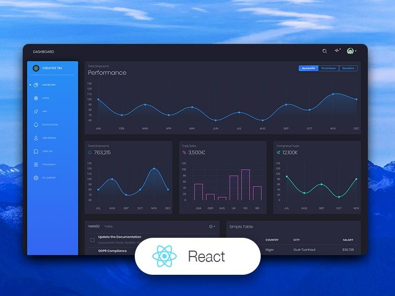

## 4. Conocimientos previos.
Para realizar esta práctica, el estudiante necesita tener claros los siguientes temas:

* Uso básico de Docker CLI: ```docker build```, ```docker run```, ```docker ps```, etc.

* Conceptos de contenedores, imágenes y Dockerfile.

* Manejo básico de Git: ```git clone```.

* Ejecución de proyectos en **Node.js** / **React**: ```npm install```, ```npm start```, ```npm run build```.

* Comprensión del flujo cliente-servidor para ejecutar el mockAPI en paralelo.

* Lectura básica de documentación oficial o Cheat Sheets.
## 5. Objetivos a alcanzar.
* Clonar y ejecutar localmente una aplicación React para verificar su funcionamiento.

* Crear un Dockerfile adecuado para contenerizar la aplicación React.

* Generar la imagen Docker a partir del Dockerfile creado.

* Ejecutar el contenedor de la aplicación React junto con el mockAPI backend.

* Validar el despliegue de la aplicación desde el contenedor.

## 6. Equipo necesario.
* Computadora con sistema operativo: **Windows, Linux o MacOS**.

* Cuenta activa en **Docker Play** o entorno **Docker local**.

* Docker versión **20.10** o superior.

* **Node.js** y **npm** instalados para pruebas locales previas.

* Acceso a **Git** para clonar los repositorios.

* Conexión a internet para descargar dependencias y repositorios.

## 7. Material de apoyo.
* Documentación oficial de Docker

* Documentación oficial de React

* Repositorio del Frontend

* Repositorio del MockAPI Backend

* Cheat Sheet de comandos Docker y Linux

* Guía de la práctica por el docente

## 8. Procedimiento.
* ### Paso 1: **Clonamos los dos repositorios**
Abrimos nuestra terminal, en este caso voy a usar la CMD de windows y ejecutamos los siguientes comandos para clonar los dos repositorios:
```
git clone https://github.com/Daviddotcoms/suda-frontend-s6.git
git clone https://github.com/Daviddotcoms/mockAPI.git
```
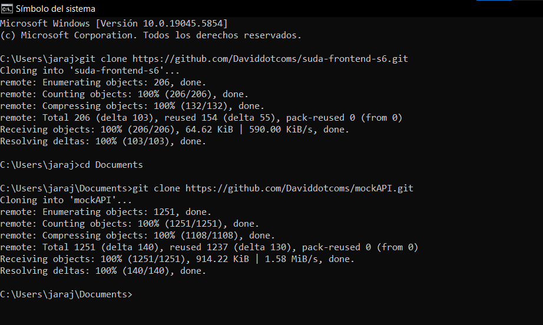

*Figura 1-1*: Repositorios tanto del frontend como del backend clonados correctamente.

* ### Paso 2: **Navegamos hacia los repositorios clonados e instalamos sus dependencias necesarias**
Dentro de la terminal de nuestros respectivos proyectos ejecutamos el siguiente comando para instalar sus dependencias: 
```
npm install
```
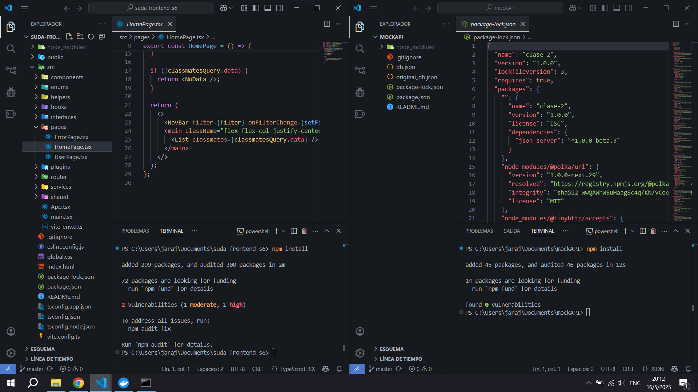

*Figura 1-2*: Dependencias instaladas correctamente. 

* ### Paso 3: **Levantamos y probamos los proyectos localmente**
Primero levantamos el backend (mockAPI) con el siguiente comando:
```
npm start
```

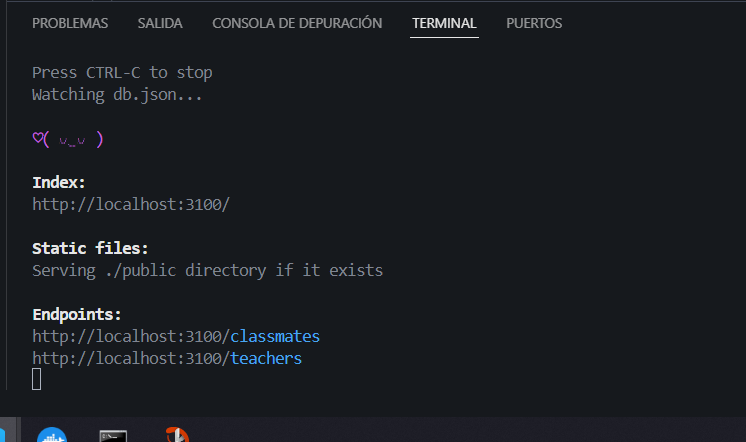
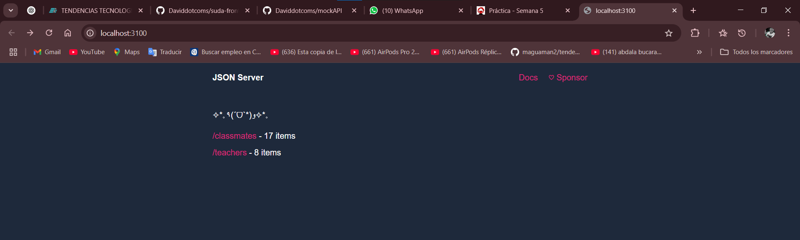

*Figura 1-3*: backend (mockAPI) corriendo correctamente en el puerto ```3100```

Luego levantamos el frontend con el siguiente comando: 
```
npm run dev
```
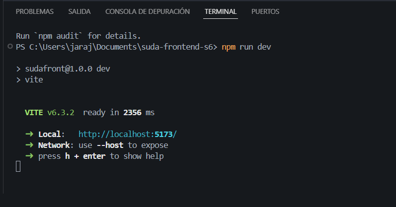
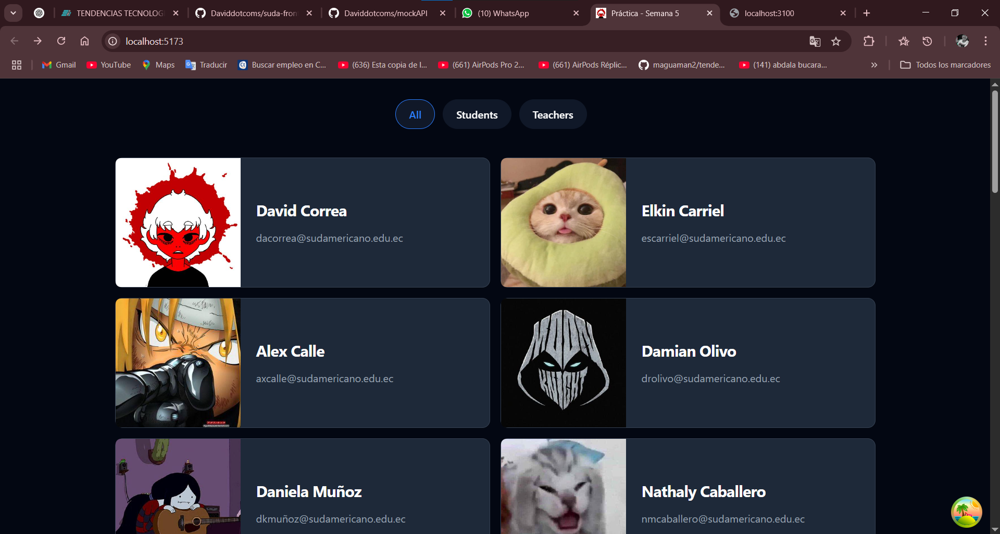

*Figura 1-3*: Frontend corriendo correctamente en el puerto ```5173```

* ### Paso 4: **Crear el archivo Dockerfile**
En la raiz del frontend *suda-frontend-s6* creamos un archivo llamado Dockerfile y escribimos lo siguiente:
```
FROM node:18 AS build

WORKDIR /app

COPY package*.json ./
RUN npm install

COPY . .
RUN npm run build

# Etapa de producción
FROM nginx:alpine

COPY --from=build /app/dist /usr/share/nginx/html

EXPOSE 80

CMD ["nginx", "-g", "daemon off;"]
```
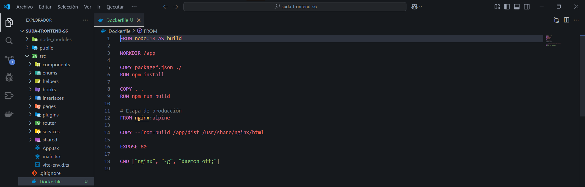

*Figura 1-4*: Codigo del archivo Dockerfile

* ### Paso 5: **Construimos la imagen**
Ahora procedemos a construir la imagen, desde la carpeta raiz del frontend, ejecutamos el siguiente comando en la terminal:
```
docker build -t react-app-suda .
```
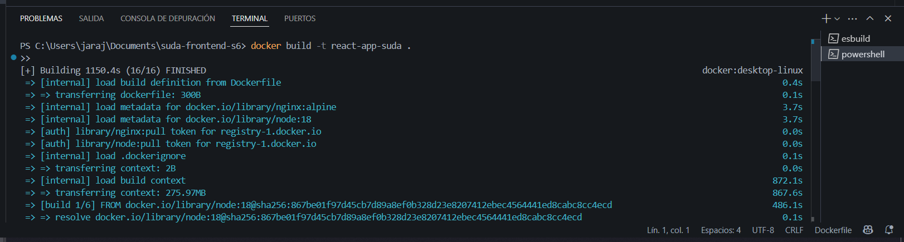

*Figura 1-5*: Imagen Docker construida correctamente

* ### Paso 6: **Ejecutamos el contenedor**
En la misma terminal ejecutamos el siguiente comando:
```
docker run -d -p 8000:80 react-app-suda
```
En nuestro navegador abrimos ```http://localhost:8000```, la aplicación debe cargar correctamente. 

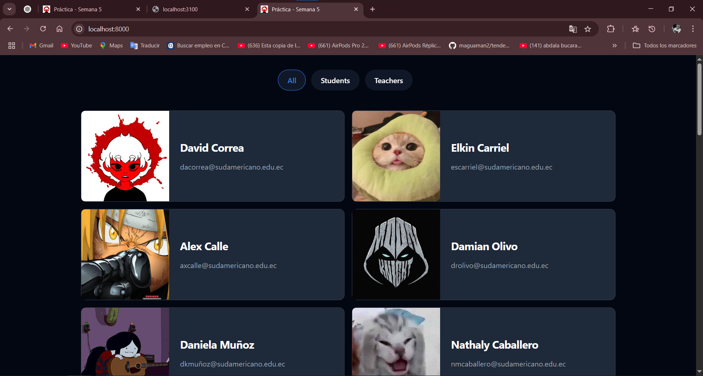

*Figura 1-6*: La aplicación carga y se conecta correctamente al backend mockAPI que ya esta corriendo

* ### Paso 6: **Verficamos en Docker Desktop que este corriendo nuestro contenedor**
En el dashboard de Docker Desktop debemos de ver que nuestro contenedor ```react-app-suda``` este corriendo. 

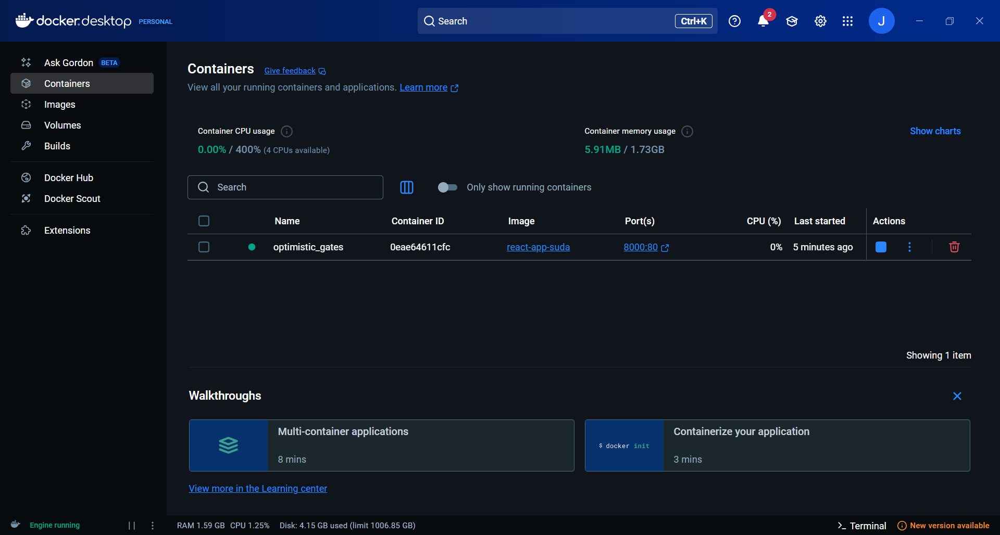

*Figura 1-7*: Contenedor ```react-app-suda``` corriendo correctamente

## 9. Resultados esperados.
Durante el desarrollo de la práctica se llevaron a cabo correctamente los pasos definidos en las instrucciones:

1. **Clonado de repositorios:**

Se clonaron exitosamente los repositorios proporcionados:

* Frontend: ```https://github.com/Daviddotcoms/suda-frontend-s6```

* MockAPI (backend simulado): ```https://github.com/Daviddotcoms/mockAPI```

2. **Instalación de dependencias:**

En ambos proyectos se ejecutó el comando ```npm install```, dejando listos los entornos para su ejecución local. Se identificaron algunas vulnerabilidades en el frontend, pero no afectaron la ejecución ni los objetivos de la práctica.

3. **Prueba local del funcionamiento:**


* Se levantó el mockAPI usando ```npm start```.

* Se levantó el frontend con npm ```run dev```.

* La aplicación se visualizó correctamente en el navegador en la dirección ```http://localhost:5173```, mostrando interacción con el mockAPI sin errores aparentes.

4. **Creación del Dockerfile:**

Se elaboró un Dockerfile multi-etapa que realiza la construcción de la aplicación React y posteriormente sirve los archivos generados usando Nginx.

5. **Construcción de la imagen Docker:**

Se construyó exitosamente la imagen Docker utilizando el comando ```docker build -t react-app-suda .```, generando una imagen funcional del frontend.

6. **Ejecución del contenedor:**

El contenedor se ejecutó correctamente con el comando ```docker run -d -p 8000:80 react-app-suda```, exponiendo la aplicación en el puerto ```8000```.

7. **Verificación final:**

* Se accedió desde el navegador a ```http://localhost:8000.```

* La aplicación mostró el contenido correctamente.

* La comunicación con el **mockAPI**, que se mantenía ejecutándose en paralelo, fue exitosa.

## 10. Audio Explicativo.
[Link del Audio explicativo](https://drive.google.com/file/d/1mRD9TRiOfr4S_eeLaZxyVZdYS3swnMnz/view?usp=sharing)

## 11. Bibliografía.
- *Docker Desktop (2025).* **Recuperado de:** <https://docs.docker.com/desktop/>

- *React Inicio Rápido (2025).* **Recuperado de:** <https://es.react.dev/learn>

- *Repositorio del frontend* <https://github.com/Daviddotcoms/suda-frontend-s6>

- *Repositorio del backend mockAPI* <https://github.com/Daviddotcoms/mockAPI>