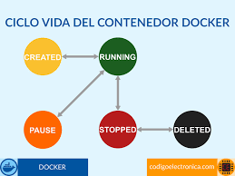

# Práctica Volúmenes para persistir base de datos
## 1. Título.
Crear volúmenes para persistir base de datos con PostgreSQL.
## 2. Tiempo de duración.
- **Parte 1 - Sin volúmen: 50 minutos**
* Creación del contenedor ```server_db1```
* Conexión al contenedor desde el administrador de bases de datos
* Creación de la base de datos test y la tabla customer
* Inserción de datos y eliminación del contenedor
* Verificación de la pérdida de datos

- **Parte 2 - Con volúmen: 50 minutos**
* Creación del volumen Docker
* Despliegue del contenedor ```server_db2``` asociado al volumen
* Repetición del proceso de creación de base de datos y tabla
* Inserción de registros
* Eliminación y recreación del contenedor
* Verificación de la persistencia de datos
### Tiempo total estimado: 100 minutos
## 3. Fundamentos.
Para entender la relización de esta práctica es necesario comprender los conceptos básicos de contenedores, persistencia de datos y cómo Docker maneja el almacenamiento. Docker es una plataforma que permite crear, desplegar y ejecutar aplicaciones dentro de contenedores. Un contenedor es como una “caja” que empaqueta todo lo que una aplicación necesita para correr, pero de forma ligera y portable.

PostgreSQL es un sistema de gestión de bases de datos relacional, robusto, open-source, que se usa mucho en ambientes empresariales y de desarrollo, por defecto, cuando corremos una base de datos en un contenedor sin un volumen, los datos viven dentro del contenedor; Así que si borramos ese contenedor, lamentablemente perdemos datos.

Por el contrario, cuando usamos un volumen, los datos se guardan fuera del contenedor, en el sistema de archivos del host. Así, aunque eliminemos el contenedor, los datos sobreviven.

### Diagrama de arquitectura docker.


### Estructura de volumen persistente


### Ciclo de vida de contenedor sin volumen



## 4. Conocimientos previos.
Para llevar a cabo esta práctica, el estudiante debe tener conocimientos sobre:

- **Uso básico de la terminal ```CLI```**

- **Comandos fundamentales de Docker ```docker run```, ```docker volume```, ```docker rm```, etc.**

- **Conceptos de contenedores y volúmenes**

- **Conexión a bases de datos desde herramientas gráficas como *DataGrip* o *TablePlus***

- **Fundamentos de SQL: creación de bases de datos, tablas e inserción de datos**
## 5. Objetivos a alcanzar.
* Comprender la diferencia entre datos persistentes y no persistentes en Docker.

* Comprobar la pérdida de datos en un contenedor PostgreSQL sin volumen.

* Comprobar la persistencia de datos al usar un volumen.

* Familiarizarse con la creación de volúmenes y su asociación con contenedores Docker.

* Practicar la conexión a bases de datos en contenedores desde un cliente externo.
## 6. Equipo necesario.
* Computadora con sistema operativo Windows, Linux o MacOS.

* Docker Desktop instalado y funcionando correctamente.

* Cliente de base de datos como DataGrip, DBeaver, TablePlus, etc.

* Acceso a internet para documentación y descarga de imágenes Docker.
## 7. Material de apoyo.
* Documentación oficial de Docker

* Documentación oficial de PostgreSQL

* Tutoriales de conexión de clientes externos a bases de datos en Docker por parte del docente.

* Foros y comunidades como StackOverflow, GitHub Discussions, Reddit r/docker.
## 8. Procedimiento.
### **PARTE 1: PostgreSQL SIN volumen**
### Paso 1: **Verficamos que tenemos todos los requisitos necesarios como: tener instalado Docker Desktop, verificar que Docker este corriendo.**


*Figura 1-1*: Contenedor server_db1 corriendo en Docker Desktop.

### Paso 2: **Ahora vamos a lanzar el contenedor de PostgreSQL SIN volumen.**
Ejecutamos el siguiente comando, en cualquier terminal, en mi caso voy a estar usando la terminal de Git Bash
```
docker run --name server_db1 -e POSTGRES_PASSWORD=123456 -p 5432:5432 -d postgres
```


*Figura 1-2*: Contenedor server_db1 lanzado en la terminal de Git Bash.

### Paso 3. **Después ejecutamos el siguiente comando.**
Esto es para poder ver el contenedor ```server_db1```, en la lista, como podemos ver esta corriendo correctamente.


*Figura 1-3*: Contenedor server_db1 corriendo correctamente.

### Paso 4. **Conectar desde TablePlus.**
Abrimos TablePlus y creamos una nueva conexión y llenamos todos los campos necesarios.


*Figura 1-3*: Conexión de TablePlus.

### Paso 5. **Crear la base de datos ```Test```.**
Ahora creamos una base de datos que llamaremos test en TablePlus, mediante la siguiente sentencia SQL 
```
CREATE DATABASE test;
```


*Figura 1-4*: Base de datos ```test``` creada correctamente.

Confirmamos que se creó la base de datos navegando hacía a ella con 
```Ctrl + k```

### Paso 6. **Creamos la tabla ```customer```.**
Abrimos una nueva pestaña de consulta SQL y pegamos la siguiente sentencia.
```
CREATE TABLE customer (
  id SERIAL PRIMARY KEY,
  fullname VARCHAR(100),
  status BOOLEAN
);
```


*Figura 1-4*: Creación de columnas para la tabla ```customer```.

### Paso 7. **Insertar un registro en la tabla ```customer```.**
En la misma pestaña de SQL pegamos esta sentencia:
```
INSERT INTO customer (fullname, status)
VALUES ('Juan Pérez', true);
```


*Figura 1-4*: Insersión de datos en la tabla ```customer```.

Una vez realizado un inser into, procedemos a verificar los datos insertados con un ```SELECT```:
```
SELECT * FROM customer;
```


*Figura 1-5*: Datos insertados correctamente.

### Paso 8. **Eliminamos el contenedor.**
Ahora vamos a ver lo que pasa cuando eliminamos un contenedor sin haber usado volumen, en la misma terminal de Git, ejecutamos el siguiente comando:
```
docker stop server_db1
```
Ahora vamos a eliminar el contenedor creado con este siguiente comando:
```
docker rm server_db1
```


*Figura 1-6*: Se ha eliminado completamente nuestro primer contenedor sin volúmen.

### **PARTE 2: PostgreSQL CON volumen**
### Paso 1. **Crear un volúmen con Docker.**
Abrimos nuestra misma terminal Git Bash y ejecutamos el siguiente comando:
```
docker volume create pgdata
```


*Figura 1-7*: Contenedor server_db2 corriendo en Docker Desktop.

### Paso 2. **Crear contenedor ```server_db2``` usando el volúmen.**
```
docker run --name server_db2 -e POSTGRES_PASSWORD=123456 -p 5433:5432 -v pgdata:/var/lib/postgresql/data -d postgres
```


*Figura 1-8*: Contenedor server_db2 corriendo correctamente, usamos el puerto 5433 para evitar conflictos con el anterior contenedor.

### Paso 3. **Conectarse desde TablePlus**
Creamos una nueva conexión postgreSQL y llenamos los campos necesrios.


*Figura 1-9*: Conexión de TablePlus para server_db2.

### Paso 4. **Creamos una vez más la base de datos ```test```.
Ejecutamos nuevamente la sentencia SQL.
```
CREATE DATABASE test;
```
Ahora creamos la tabla ```customer``` nuevamente e insertamos datos 

```
CREATE TABLE customer (
  id SERIAL PRIMARY KEY,
  fullname VARCHAR(100),
  status BOOLEAN
);

INSERT INTO customer (fullname, status)
VALUES ('María Gómez', true);
```


*Figura 1-10*: Creación de las filas para la tabla ```customer``` del contenedor server_db2.

Verificamos los datos ya creados


*Figura 1-11*: Datos para la tabla ```customer``` del contenedor server_db2.

### Paso 5. **Eliminar el contenedor ```server_db2``` con volumen**
Ejecutamos los siguientes comandos en la terminal.

*Para detener el contenedor:*
```
docker stop server_db2
```
*Para eliminar el contenedor:*
```
docker rm server_db2
```


*Figura 1-12*: Contenedor ```server_db2``` eliminado correctamente.

### Paso 6. **Volvemos a crear el contenedor con el mismo volumen**
Ejecutamos el mismo comando en nuestra terminal
```
docker run --name server_db2 -e POSTGRES_PASSWORD=123456 -p 5433:5432 -v pgdata:/var/lib/postgresql/data -d postgres
```
### Paso 7. **Re-conectarse y verificar que los datos están**
Volvemos a abrir la conexión en TablePlus que apunta a server_db2 seleccionamos la base test


*Figura 1-13*: La base de datos de ```server_db2``` no perdió su información a pesar de eliminar su contenedor.

## 9. Resultados esperados.
- **Parte 1 SIN - volumen:**
Al eliminar el contenedor server_db1 y volver a crearlo, la base de datos test y su contenido se eliminaron, demostrando que sin volumen los datos no persisten.


- **Parte 2 CON - volumen:**
Al eliminar el contenedor server_db2 y recrearlo usando el volumen pgdata, la base de datos test y la tabla customer se mantiene intactas, validando que el uso de volúmenes permite la persistencia de datos.


## 10. Audio explicativo.
[Link del audio explicativo](https://drive.google.com/file/d/1-7af2O7s1NLY1aMLIx-xhjWC9y8agpZh/view?usp=sharing) 
## 11. Bibliografía
- *Docker Desktop (2025).* **Recuperado de:** <https://docs.docker.com/desktop/>

- *Documentation PostgreSQL (2025).* **Recuperado de:** <https://www.postgresql.org/docs/>

- *TablePlus Documentation (2025).* **Recuperado de:** <https://docs.tableplus.com/>


